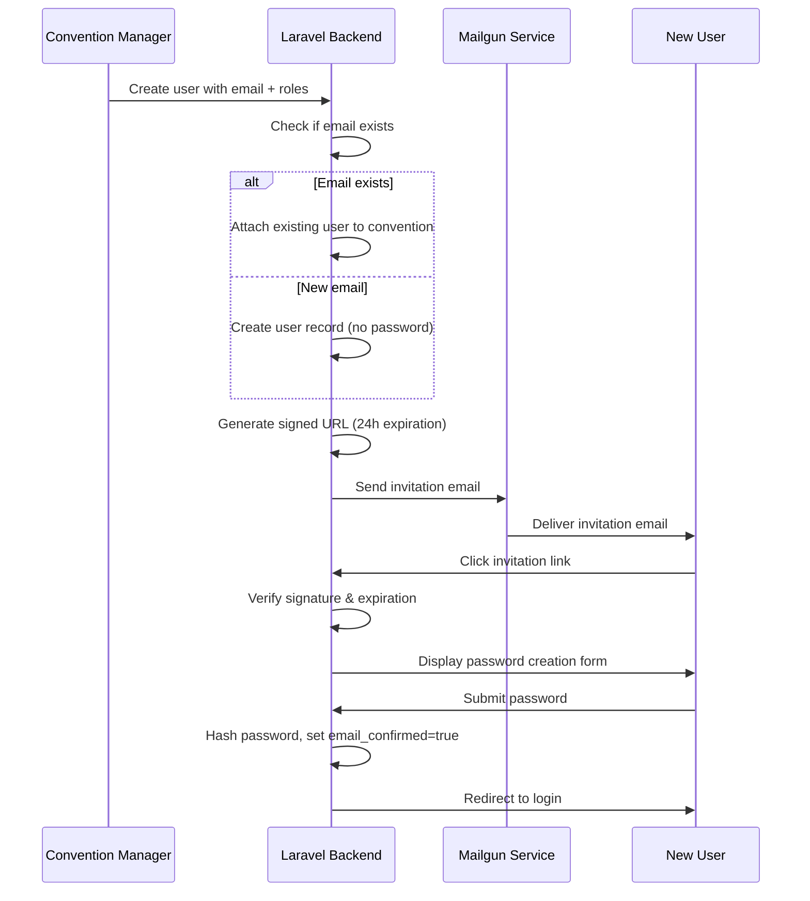
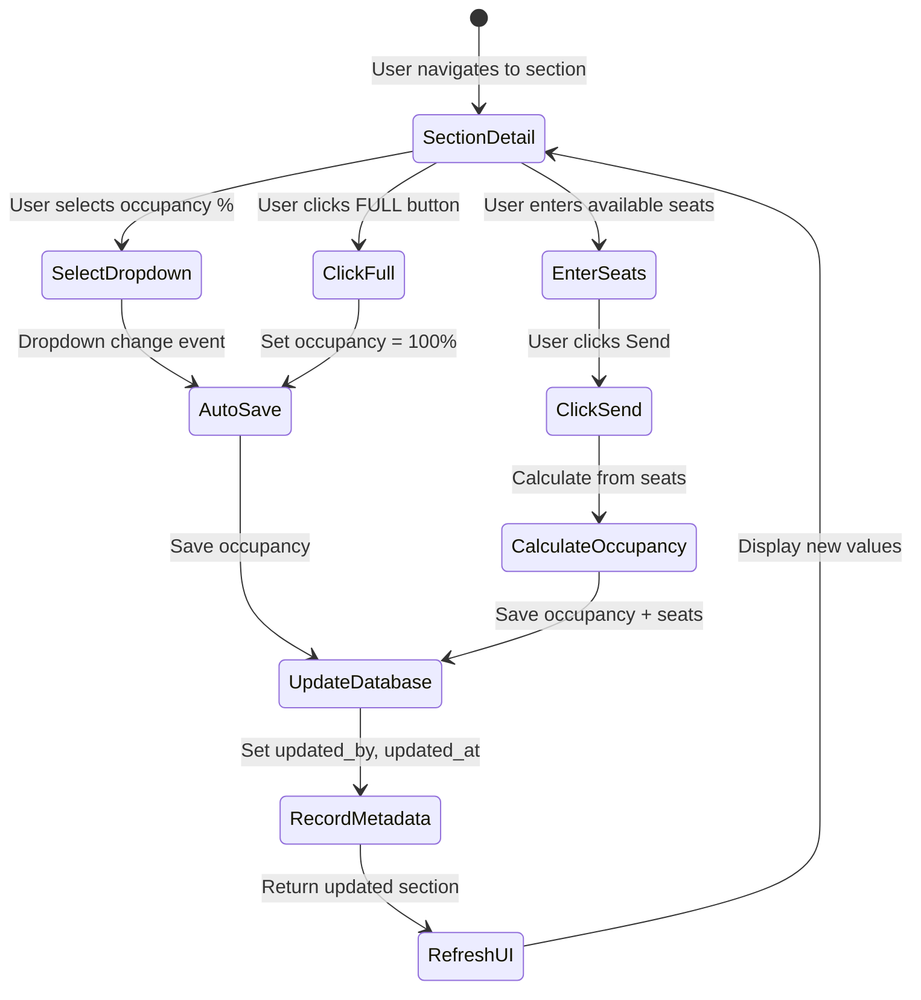
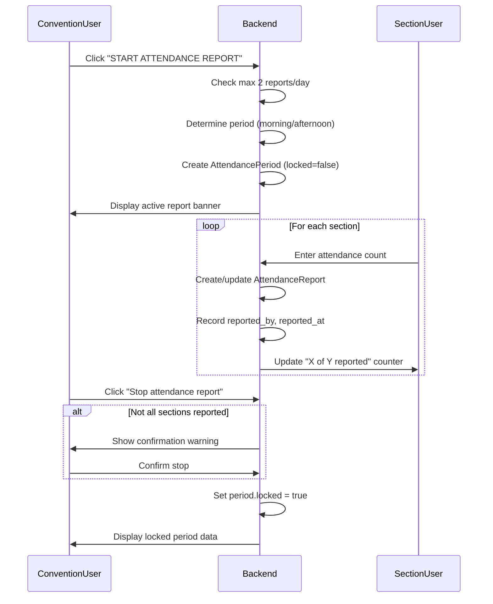

# Design Document: Convention Management System

## Overview

The Convention Management System is a full-stack Laravel + React application that enables convention organizers to manage multi-day events with real-time occupancy tracking, attendance reporting, and role-based access control. The system provides a mobile-first Progressive Web App experience optimized for on-site convention management.

### Core Capabilities

- Convention lifecycle management with date validation and conflict detection
- Hierarchical venue organization (Convention → Floor → Section)
- Real-time section occupancy tracking with visual indicators
- Time-bound attendance reporting with morning/afternoon periods
- Four-tier role-based access control (Owner, ConventionUser, FloorUser, SectionUser)
- Secure user invitation flow with email confirmation
- Multi-format data export (.xlsx, .docx, Markdown)
- Mobile-optimized search for available sections with accessibility filters
- PWA installation for native-like mobile experience

### Technology Stack

- **Backend**: Laravel 12.0 with PHP 8.2+, SQLite database
- **Frontend**: React 19 with TypeScript, Inertia.js, Tailwind CSS 4
- **Authentication**: Laravel Fortify with signed URL invitations
- **Email**: Mailgun for transactional emails
- **Scheduling**: Laravel Scheduler for daily occupancy resets
- **Export**: maatwebsite/excel, phpoffice/phpword
- **PWA**: Web App Manifest + Service Worker


## Architecture

### System Architecture

The application follows a traditional MVC architecture with Inertia.js bridging Laravel and React:

```
┌─────────────────────────────────────────────────────────────┐
│                         Client Layer                         │
│  React 19 + TypeScript + Inertia.js + Tailwind CSS 4       │
│  - Page Components (Inertia pages)                          │
│  - UI Components (Radix UI, Headless UI)                    │
│  - Type-safe routing (Wayfinder actions)                    │
│  - PWA Service Worker                                        │
└─────────────────────────────────────────────────────────────┘
                              ↕ HTTP/JSON
┌─────────────────────────────────────────────────────────────┐
│                      Inertia.js Bridge                       │
│  - Server-side rendering support                            │
│  - Automatic prop serialization                             │
│  - Shared data (auth user, flash messages)                  │
└─────────────────────────────────────────────────────────────┘
                              ↕
┌─────────────────────────────────────────────────────────────┐
│                      Application Layer                       │
│  Laravel 12.0 Controllers + Form Requests + Middleware      │
│  - ConventionController                                     │
│  - FloorController, SectionController                       │
│  - UserController, AttendanceController                     │
│  - Role-based authorization middleware                      │
└─────────────────────────────────────────────────────────────┘
                              ↕
┌─────────────────────────────────────────────────────────────┐
│                       Business Logic                         │
│  Actions + Services                                         │
│  - CreateConventionAction                                   │
│  - InviteUserAction                                         │
│  - UpdateOccupancyAction                                    │
│  - ExportConventionAction                                   │
│  - AttendanceReportService                                  │
└─────────────────────────────────────────────────────────────┘
                              ↕
┌─────────────────────────────────────────────────────────────┐
│                         Data Layer                           │
│  Eloquent Models + Relationships                            │
│  - Convention, Floor, Section, User                         │
│  - AttendancePeriod, AttendanceReport                       │
│  - Pivot: ConventionUser, FloorUser, SectionUser            │
└─────────────────────────────────────────────────────────────┘
                              ↕
┌─────────────────────────────────────────────────────────────┐
│                      SQLite Database                         │
└─────────────────────────────────────────────────────────────┘

External Services:
┌──────────────┐         ┌──────────────┐
│   Mailgun    │         │   Laravel    │
│   (Email)    │         │  Scheduler   │
└──────────────┘         └──────────────┘
```

### Request Flow

1. **User Action**: User interacts with React component
2. **Inertia Request**: Component calls Wayfinder type-safe route action
3. **Laravel Routing**: Request hits Laravel controller method
4. **Authorization**: Middleware checks role-based permissions
5. **Validation**: Form Request validates input
6. **Business Logic**: Action/Service executes domain logic
7. **Data Persistence**: Eloquent models save to database
8. **Inertia Response**: Controller returns Inertia response with props
9. **React Render**: Inertia updates React component with new props


## Components and Interfaces

### Backend Components

#### Controllers

**ConventionController**
- `index()`: List conventions for authenticated user
- `create()`: Show convention creation form
- `store(StoreConventionRequest)`: Create convention with validation
- `show(Convention)`: Display convention detail with role-scoped data
- `update(UpdateConventionRequest, Convention)`: Update convention details
- `destroy(Convention)`: Delete convention (Owner only)
- `export(Convention, string $format)`: Export convention data

**FloorController**
- `index(Convention)`: List floors (role-scoped)
- `store(StoreFloorRequest, Convention)`: Create floor
- `update(UpdateFloorRequest, Floor)`: Update floor name
- `destroy(Floor)`: Delete floor and cascade sections

**SectionController**
- `index(Floor)`: List sections in floor
- `show(Section)`: Display section detail with occupancy controls
- `store(StoreSectionRequest, Floor)`: Create section
- `update(UpdateSectionRequest, Section)`: Update section attributes
- `updateOccupancy(UpdateOccupancyRequest, Section)`: Update occupancy percentage
- `setFull(Section)`: Set occupancy to 100%
- `destroy(Section)`: Delete section

**UserController**
- `index(Convention)`: List users (role-scoped)
- `store(StoreUserRequest, Convention)`: Create/invite user
- `update(UpdateUserRequest, User)`: Update user details
- `destroy(User, Convention)`: Remove user from convention
- `resendInvitation(User)`: Resend invitation email

**AttendanceController**
- `start(Convention)`: Start attendance report period
- `stop(Convention, AttendancePeriod)`: Lock attendance period
- `report(ReportAttendanceRequest, Section, AttendancePeriod)`: Submit section attendance

**SearchController**
- `index(SearchRequest)`: Search available sections with filters

**Auth/InvitationController**
- `show(string $token)`: Display password creation form
- `store(SetPasswordRequest)`: Set password and confirm email

#### Form Requests

**StoreConventionRequest**
- Validates: name, city, country, start_date, end_date, address (optional), other_info (optional)
- Custom rule: Check for overlapping conventions in same city/country

**UpdateOccupancyRequest**
- Validates: occupancy (enum: 0, 10, 25, 50, 75, 100) OR available_seats (integer, min: 0)
- Calculates occupancy percentage from available_seats if provided

**StoreUserRequest**
- Validates: first_name, last_name, email (unique, not containing "jwpub.org"), mobile
- Validates: roles array (Owner, ConventionUser, FloorUser, SectionUser)
- Validates: floor_ids array (required if FloorUser role)
- Validates: section_ids array (required if SectionUser role)

**ReportAttendanceRequest**
- Validates: attendance (integer, min: 0)
- Validates: period_id (exists in attendance_periods)

#### Actions

**CreateConventionAction**
```php
public function execute(array $data, User $creator): Convention
{
    // Create convention
    // Assign creator as Owner and ConventionUser
    // Create attendance periods for date range
    // Return convention
}
```

**InviteUserAction**
```php
public function execute(array $data, Convention $convention): User
{
    // Find or create user by email
    // Attach to convention with roles
    // Attach to floors/sections if scoped roles
    // Generate signed invitation URL
    // Send invitation email via Mailgun
    // Return user
}
```

**UpdateOccupancyAction**
```php
public function execute(Section $section, array $data, User $user): Section
{
    // Calculate occupancy percentage
    // Update section occupancy and available_seats
    // Record last_occupancy_updated_by and timestamp
    // Return updated section
}
```

**ExportConventionAction**
```php
public function execute(Convention $convention, string $format): string
{
    // Load all related data (floors, sections, users, attendance)
    // Serialize based on format (.xlsx, .docx, .md)
    // Return file path for download
}
```

**AttendanceReportService**
```php
public function startReport(Convention $convention): AttendancePeriod
{
    // Determine current period (morning/afternoon)
    // Validate max 2 reports per day
    // Create or retrieve attendance period
    // Return active period
}

public function stopReport(AttendancePeriod $period): void
{
    // Lock period
    // Prevent further updates
}

public function reportAttendance(Section $section, AttendancePeriod $period, int $attendance, User $user): void
{
    // Create or update attendance report
    // Record reported_by and reported_at
    // Validate user has permission for section
}
```

#### Middleware

**EnsureConventionAccess**
- Verifies user has any role for the convention
- Aborts with 403 if no access

**EnsureOwnerRole**
- Verifies user has Owner role for the convention
- Aborts with 403 if not owner

**ScopeByRole**
- Filters query results based on user's role scope
- Applied to floor, section, and user queries


### Frontend Components

#### Page Components (Inertia Pages)

**pages/conventions/index.tsx**
- Lists user's conventions
- "Create Convention" button
- Convention cards with dates and location

**pages/conventions/create.tsx**
- Convention creation form
- Date range validation
- City/country conflict detection

**pages/conventions/show.tsx**
- Convention detail with role-scoped data
- Floors datatable with expandable sections
- Export dropdown (Owner only)
- Delete button (Owner only)
- Attendance report controls (ConventionUser)

**pages/floors/index.tsx**
- Floors list for convention
- Add floor button (ConventionUser only)
- Occupancy color coding

**pages/sections/show.tsx**
- Section detail with occupancy controls
- Occupancy dropdown (0%, 10%, 25%, 50%, 75%, 100%)
- "FULL" panic button
- Available seats input with "Send" button
- Last update footer
- Attendance reporting (if active period)

**pages/users/index.tsx**
- Users list (role-scoped)
- Add user button
- Email confirmation status icons
- Resend invitation button
- Role badges

**pages/search/index.tsx**
- Floor filter dropdown
- Elder-friendly checkbox
- Handicap-friendly checkbox
- Results list with occupancy < 90%
- Sorted by occupancy ascending

**pages/auth/invitation.tsx**
- Password creation form
- Password strength indicator
- Email confirmation on submit

#### UI Components

**ConventionCard**
- Props: convention (name, dates, location)
- Displays formatted date range
- Click navigates to convention detail

**FloorRow**
- Props: floor, sections, userRole
- Expandable row showing sections
- Occupancy color indicator
- Edit/delete actions (role-based)

**SectionCard**
- Props: section (name, occupancy, available_seats, accessibility)
- Color-coded occupancy icon
- Accessibility badges
- Click navigates to section detail

**OccupancyDropdown**
- Props: currentOccupancy, onUpdate
- Options: 0%, 10%, 25%, 50%, 75%, 100%
- Auto-saves on selection

**AttendanceReportBanner**
- Props: activePeriod, totalAttendance, reportedCount, totalCount
- Displays "X of Y sections reported"
- "Stop attendance report" button

**UserRow**
- Props: user (name, email, roles, email_confirmed)
- Email confirmation icon (green checkmark or warning)
- Role badges
- Resend invitation button
- Edit/delete actions

**ExportDropdown**
- Props: convention, onExport
- Format options: .xlsx, .docx, Markdown
- Triggers download on selection

**RoleBadge**
- Props: role (Owner, ConventionUser, FloorUser, SectionUser)
- Color-coded badge

**OccupancyIndicator**
- Props: occupancy (0-100)
- Returns color class based on percentage:
  - 0-25%: green
  - 26-50%: dark green
  - 51-75%: yellow
  - 76-90%: orange
  - 91-100%: red

#### Hooks

**useConventionRole**
```typescript
function useConventionRole(convention: Convention): {
  isOwner: boolean;
  isConventionUser: boolean;
  isFloorUser: boolean;
  isSectionUser: boolean;
  hasFloorAccess: (floorId: number) => boolean;
  hasSectionAccess: (sectionId: number) => boolean;
}
```

**useOccupancyColor**
```typescript
function useOccupancyColor(occupancy: number): string
// Returns Tailwind color class based on occupancy percentage
```

**useAttendanceReport**
```typescript
function useAttendanceReport(convention: Convention): {
  activePeriod: AttendancePeriod | null;
  canStart: boolean;
  canStop: boolean;
  reportedCount: number;
  totalCount: number;
}
```


## Data Models

### Database Schema

#### conventions
```sql
CREATE TABLE conventions (
    id INTEGER PRIMARY KEY AUTOINCREMENT,
    name VARCHAR(255) NOT NULL,
    city VARCHAR(255) NOT NULL,
    country VARCHAR(255) NOT NULL,
    address TEXT,
    start_date DATE NOT NULL,
    end_date DATE NOT NULL,
    other_info TEXT,
    created_at TIMESTAMP,
    updated_at TIMESTAMP,
    CONSTRAINT check_dates CHECK (end_date >= start_date)
);

CREATE INDEX idx_conventions_location ON conventions(city, country);
CREATE INDEX idx_conventions_dates ON conventions(start_date, end_date);
```

#### floors
```sql
CREATE TABLE floors (
    id INTEGER PRIMARY KEY AUTOINCREMENT,
    convention_id INTEGER NOT NULL,
    name VARCHAR(255) NOT NULL,
    created_at TIMESTAMP,
    updated_at TIMESTAMP,
    FOREIGN KEY (convention_id) REFERENCES conventions(id) ON DELETE CASCADE
);

CREATE INDEX idx_floors_convention ON floors(convention_id);
```

#### sections
```sql
CREATE TABLE sections (
    id INTEGER PRIMARY KEY AUTOINCREMENT,
    floor_id INTEGER NOT NULL,
    name VARCHAR(255) NOT NULL,
    number_of_seats INTEGER NOT NULL,
    occupancy INTEGER DEFAULT 0 CHECK (occupancy >= 0 AND occupancy <= 100),
    available_seats INTEGER DEFAULT 0 CHECK (available_seats >= 0),
    elder_friendly BOOLEAN DEFAULT FALSE,
    handicap_friendly BOOLEAN DEFAULT FALSE,
    information TEXT,
    last_occupancy_updated_by INTEGER,
    last_occupancy_updated_at TIMESTAMP,
    created_at TIMESTAMP,
    updated_at TIMESTAMP,
    FOREIGN KEY (floor_id) REFERENCES floors(id) ON DELETE CASCADE,
    FOREIGN KEY (last_occupancy_updated_by) REFERENCES users(id) ON DELETE SET NULL
);

CREATE INDEX idx_sections_floor ON sections(floor_id);
CREATE INDEX idx_sections_occupancy ON sections(occupancy);
CREATE INDEX idx_sections_accessibility ON sections(elder_friendly, handicap_friendly);
```

#### users
```sql
CREATE TABLE users (
    id INTEGER PRIMARY KEY AUTOINCREMENT,
    first_name VARCHAR(255) NOT NULL,
    last_name VARCHAR(255) NOT NULL,
    email VARCHAR(255) UNIQUE NOT NULL,
    mobile VARCHAR(255) NOT NULL,
    password VARCHAR(255),
    email_confirmed BOOLEAN DEFAULT FALSE,
    remember_token VARCHAR(100),
    created_at TIMESTAMP,
    updated_at TIMESTAMP
);

CREATE UNIQUE INDEX idx_users_email ON users(email);
```

#### convention_user (Pivot)
```sql
CREATE TABLE convention_user (
    id INTEGER PRIMARY KEY AUTOINCREMENT,
    convention_id INTEGER NOT NULL,
    user_id INTEGER NOT NULL,
    created_at TIMESTAMP,
    FOREIGN KEY (convention_id) REFERENCES conventions(id) ON DELETE CASCADE,
    FOREIGN KEY (user_id) REFERENCES users(id) ON DELETE CASCADE,
    UNIQUE(convention_id, user_id)
);

CREATE INDEX idx_convention_user_convention ON convention_user(convention_id);
CREATE INDEX idx_convention_user_user ON convention_user(user_id);
```

#### convention_user_roles (Pivot)
```sql
CREATE TABLE convention_user_roles (
    id INTEGER PRIMARY KEY AUTOINCREMENT,
    convention_id INTEGER NOT NULL,
    user_id INTEGER NOT NULL,
    role VARCHAR(50) NOT NULL CHECK (role IN ('Owner', 'ConventionUser', 'FloorUser', 'SectionUser')),
    created_at TIMESTAMP,
    FOREIGN KEY (convention_id) REFERENCES conventions(id) ON DELETE CASCADE,
    FOREIGN KEY (user_id) REFERENCES users(id) ON DELETE CASCADE,
    UNIQUE(convention_id, user_id, role)
);

CREATE INDEX idx_convention_user_roles_lookup ON convention_user_roles(convention_id, user_id);
```

#### floor_user (Pivot)
```sql
CREATE TABLE floor_user (
    id INTEGER PRIMARY KEY AUTOINCREMENT,
    floor_id INTEGER NOT NULL,
    user_id INTEGER NOT NULL,
    created_at TIMESTAMP,
    FOREIGN KEY (floor_id) REFERENCES floors(id) ON DELETE CASCADE,
    FOREIGN KEY (user_id) REFERENCES users(id) ON DELETE CASCADE,
    UNIQUE(floor_id, user_id)
);

CREATE INDEX idx_floor_user_floor ON floor_user(floor_id);
CREATE INDEX idx_floor_user_user ON floor_user(user_id);
```

#### section_user (Pivot)
```sql
CREATE TABLE section_user (
    id INTEGER PRIMARY KEY AUTOINCREMENT,
    section_id INTEGER NOT NULL,
    user_id INTEGER NOT NULL,
    created_at TIMESTAMP,
    FOREIGN KEY (section_id) REFERENCES sections(id) ON DELETE CASCADE,
    FOREIGN KEY (user_id) REFERENCES users(id) ON DELETE CASCADE,
    UNIQUE(section_id, user_id)
);

CREATE INDEX idx_section_user_section ON section_user(section_id);
CREATE INDEX idx_section_user_user ON section_user(user_id);
```

#### attendance_periods
```sql
CREATE TABLE attendance_periods (
    id INTEGER PRIMARY KEY AUTOINCREMENT,
    convention_id INTEGER NOT NULL,
    date DATE NOT NULL,
    period VARCHAR(20) NOT NULL CHECK (period IN ('morning', 'afternoon')),
    locked BOOLEAN DEFAULT FALSE,
    created_at TIMESTAMP,
    updated_at TIMESTAMP,
    FOREIGN KEY (convention_id) REFERENCES conventions(id) ON DELETE CASCADE,
    UNIQUE(convention_id, date, period)
);

CREATE INDEX idx_attendance_periods_convention ON attendance_periods(convention_id);
CREATE INDEX idx_attendance_periods_date ON attendance_periods(date, period);
```

#### attendance_reports
```sql
CREATE TABLE attendance_reports (
    id INTEGER PRIMARY KEY AUTOINCREMENT,
    attendance_period_id INTEGER NOT NULL,
    section_id INTEGER NOT NULL,
    attendance INTEGER NOT NULL CHECK (attendance >= 0),
    reported_by INTEGER NOT NULL,
    reported_at TIMESTAMP NOT NULL,
    created_at TIMESTAMP,
    updated_at TIMESTAMP,
    FOREIGN KEY (attendance_period_id) REFERENCES attendance_periods(id) ON DELETE CASCADE,
    FOREIGN KEY (section_id) REFERENCES sections(id) ON DELETE CASCADE,
    FOREIGN KEY (reported_by) REFERENCES users(id) ON DELETE CASCADE,
    UNIQUE(attendance_period_id, section_id)
);

CREATE INDEX idx_attendance_reports_period ON attendance_reports(attendance_period_id);
CREATE INDEX idx_attendance_reports_section ON attendance_reports(section_id);
```

### Eloquent Relationships

**Convention Model**
```php
public function floors(): HasMany
public function users(): BelongsToMany // via convention_user
public function attendancePeriods(): HasMany
public function userRoles(User $user): Collection // roles for specific user
```

**Floor Model**
```php
public function convention(): BelongsTo
public function sections(): HasMany
public function users(): BelongsToMany // via floor_user
```

**Section Model**
```php
public function floor(): BelongsTo
public function users(): BelongsToMany // via section_user
public function lastUpdatedBy(): BelongsTo // User
public function attendanceReports(): HasMany
```

**User Model**
```php
public function conventions(): BelongsToMany // via convention_user
public function floors(): BelongsToMany // via floor_user
public function sections(): BelongsToMany // via section_user
public function rolesForConvention(Convention $convention): Collection
public function hasRole(Convention $convention, string $role): bool
public function hasAnyRole(Convention $convention, array $roles): bool
```

**AttendancePeriod Model**
```php
public function convention(): BelongsTo
public function reports(): HasMany // AttendanceReport
public function isActive(): bool // !locked
public function totalAttendance(): int
public function reportedSectionsCount(): int
```

**AttendanceReport Model**
```php
public function period(): BelongsTo // AttendancePeriod
public function section(): BelongsTo
public function reportedBy(): BelongsTo // User
```

### Data Validation Rules

**Convention Overlap Detection**
```php
// Custom validation rule
Rule::unique('conventions')->where(function ($query) use ($data) {
    return $query->where('city', $data['city'])
                 ->where('country', $data['country'])
                 ->where(function ($q) use ($data) {
                     $q->whereBetween('start_date', [$data['start_date'], $data['end_date']])
                       ->orWhereBetween('end_date', [$data['start_date'], $data['end_date']])
                       ->orWhere(function ($q2) use ($data) {
                           $q2->where('start_date', '<=', $data['start_date'])
                              ->where('end_date', '>=', $data['end_date']);
                       });
                 });
});
```

**Email Domain Restriction**
```php
Rule::notRegex('/jwpub\.org/i')
```

**Password Requirements**
```php
'password' => [
    'required',
    'string',
    'min:8',
    'regex:/[a-z]/',      // lowercase
    'regex:/[A-Z]/',      // uppercase
    'regex:/[0-9]/',      // number
    'regex:/[@$!%*#?&]/', // symbol
]
```


## Authentication and Authorization

### User Invitation Flow



### Role-Based Access Control

The system implements a hierarchical role system with four levels:

**Role Hierarchy**
```
Owner (Full Control)
  ├─ All ConventionUser capabilities
  ├─ Delete convention
  ├─ Export convention data
  └─ Override all restrictions
  
ConventionUser (Convention-wide Access)
  ├─ View/edit all floors, sections, users
  ├─ Start/stop attendance reports
  ├─ Lock attendance periods
  └─ Manage all convention entities
  
FloorUser (Floor-scoped Access)
  ├─ View/edit assigned floors
  ├─ Manage sections on assigned floors
  ├─ View users on assigned floors
  └─ Report attendance for assigned sections
  
SectionUser (Section-scoped Access)
  ├─ View/edit assigned sections
  ├─ Update occupancy for assigned sections
  ├─ Report attendance for assigned sections
  └─ View users on assigned sections
```

**Authorization Implementation**

```php
// Middleware: EnsureConventionAccess
public function handle(Request $request, Closure $next, Convention $convention)
{
    if (!$request->user()->conventions->contains($convention)) {
        abort(403, 'No access to this convention');
    }
    return $next($request);
}

// Middleware: ScopeByRole
public function handle(Request $request, Closure $next)
{
    $user = $request->user();
    $convention = $request->route('convention');
    
    // Owner and ConventionUser see everything
    if ($user->hasAnyRole($convention, ['Owner', 'ConventionUser'])) {
        return $next($request);
    }
    
    // FloorUser sees only assigned floors
    if ($user->hasRole($convention, 'FloorUser')) {
        $request->merge([
            'scoped_floor_ids' => $user->floors()->pluck('id')->toArray()
        ]);
    }
    
    // SectionUser sees only assigned sections
    if ($user->hasRole($convention, 'SectionUser')) {
        $request->merge([
            'scoped_section_ids' => $user->sections()->pluck('id')->toArray()
        ]);
    }
    
    return $next($request);
}
```

**Query Scoping**

```php
// In Controller
public function index(Convention $convention, Request $request)
{
    $query = Floor::where('convention_id', $convention->id);
    
    // Apply role-based scoping
    if ($scopedFloorIds = $request->get('scoped_floor_ids')) {
        $query->whereIn('id', $scopedFloorIds);
    }
    
    return Inertia::render('Floors/Index', [
        'floors' => $query->with('sections')->get(),
    ]);
}
```

### Session Management

- Default session: Expires on browser close
- "Remember me": 30-day persistent cookie
- CSRF protection on all state-changing requests
- Rate limiting: 5 login attempts per minute per IP


## Occupancy Tracking and Attendance Reporting

### Occupancy Update Flow



**Occupancy Calculation**

```php
// When available_seats is provided
$occupancy = 100 - (($availableSeats / $section->number_of_seats) * 100);
$occupancy = max(0, min(100, round($occupancy)));

// When occupancy percentage is selected directly
$availableSeats = $section->number_of_seats * (1 - ($occupancy / 100));
$availableSeats = max(0, round($availableSeats));
```

**Color Coding Logic**

```php
function getOccupancyColor(int $occupancy): string
{
    return match(true) {
        $occupancy >= 0 && $occupancy <= 25 => 'green',
        $occupancy >= 26 && $occupancy <= 50 => 'dark-green',
        $occupancy >= 51 && $occupancy <= 75 => 'yellow',
        $occupancy >= 76 && $occupancy <= 90 => 'orange',
        $occupancy >= 91 && $occupancy <= 100 => 'red',
        default => 'gray',
    };
}
```

### Attendance Reporting Flow



**Period Determination**

```php
function getCurrentPeriod(): string
{
    $hour = now()->hour;
    return $hour < 12 ? 'morning' : 'afternoon';
}

function canStartReport(Convention $convention): bool
{
    $today = now()->toDateString();
    $reportsToday = AttendancePeriod::where('convention_id', $convention->id)
        ->whereDate('date', $today)
        ->count();
    
    return $reportsToday < 2;
}
```

**Attendance Report Restrictions**

1. **Before Lock**: Only the user who reported can update their section's attendance
2. **After Lock**: No updates allowed (period is immutable)
3. **ConventionUser Override**: Can lock period even if not all sections reported

### Daily Occupancy Reset

```php
// app/Console/Kernel.php
protected function schedule(Schedule $schedule)
{
    $schedule->call(function () {
        Section::query()->update([
            'occupancy' => 0,
            'available_seats' => 0,
            'last_occupancy_updated_by' => null,
            'last_occupancy_updated_at' => null,
        ]);
    })->dailyAt('06:00');
}
```


## Email System

### Mailgun Integration

**Configuration (.env)**
```env
MAIL_MAILER=mailgun
MAIL_FROM_ADDRESS=noreply@conventionmanager.app
MAIL_FROM_NAME="Convention Manager"
MAILGUN_DOMAIN=mg.conventionmanager.app
MAILGUN_SECRET=key-xxxxxxxxxxxxx
MAILGUN_ENDPOINT=api.mailgun.net
```

**Email Types**

1. **User Invitation Email**
   - Sent when: New user created or existing user added to convention
   - Contains: Signed URL with 24-hour expiration
   - Action: Set password and confirm email

2. **Email Confirmation Email**
   - Sent when: User updates their email address
   - Contains: Signed URL with 24-hour expiration
   - Action: Confirm new email address

**Invitation Mailable**

```php
class UserInvitation extends Mailable
{
    public function __construct(
        public User $user,
        public Convention $convention,
        public string $invitationUrl
    ) {}
    
    public function build()
    {
        return $this->subject("Invitation to {$this->convention->name}")
            ->markdown('emails.user-invitation')
            ->with([
                'userName' => $this->user->first_name,
                'conventionName' => $this->convention->name,
                'invitationUrl' => $this->invitationUrl,
                'expiresAt' => now()->addHours(24)->format('M d, Y g:i A'),
            ]);
    }
}
```

**Signed URL Generation**

```php
$invitationUrl = URL::temporarySignedRoute(
    'invitation.show',
    now()->addHours(24),
    ['user' => $user->id, 'convention' => $convention->id]
);
```

**Rate Limiting**

```php
// routes/web.php
Route::post('/users/{user}/resend-invitation', [UserController::class, 'resendInvitation'])
    ->middleware('throttle:3,60'); // 3 requests per 60 minutes
```


## Data Export System

### Export Formats

The system supports three export formats, each containing complete convention data:

**Export Data Structure**
```
Convention Export
├─ Convention Details (name, location, dates)
├─ Floors
│  └─ Sections (with capacity, occupancy, accessibility)
├─ Attendance History
│  ├─ Periods (date, morning/afternoon, locked status)
│  └─ Reports (section, attendance, reported_by, timestamp)
└─ Users (name, email, roles, assigned floors/sections)
```

### Excel Export (.xlsx)

**Implementation using maatwebsite/excel**

```php
class ConventionExport implements FromCollection, WithHeadings, WithMultipleSheets
{
    public function __construct(private Convention $convention) {}
    
    public function sheets(): array
    {
        return [
            'Convention' => new ConventionSheet($this->convention),
            'Floors & Sections' => new FloorsSheet($this->convention),
            'Attendance History' => new AttendanceSheet($this->convention),
            'Users' => new UsersSheet($this->convention),
        ];
    }
}

// Usage
Excel::download(new ConventionExport($convention), 'convention.xlsx');
```

**Floors & Sections Sheet Structure**
```
| Floor | Section | Seats | Current Occupancy | Elder Friendly | Handicap Friendly |
|-------|---------|-------|-------------------|----------------|-------------------|
| 1st   | A1      | 150   | 75%              | Yes            | Yes               |
| 1st   | A2      | 120   | 50%              | No             | Yes               |
```

**Attendance History Sheet Structure**
```
| Date       | Period    | Floor | Section | Attendance | Reported By    | Reported At         |
|------------|-----------|-------|---------|------------|----------------|---------------------|
| 2024-01-15 | Morning   | 1st   | A1      | 112        | John Smith     | 2024-01-15 09:30:00 |
| 2024-01-15 | Afternoon | 1st   | A1      | 98         | John Smith     | 2024-01-15 14:15:00 |
```

### Word Document Export (.docx)

**Implementation using phpoffice/phpword**

```php
class ConventionWordExport
{
    public function generate(Convention $convention): string
    {
        $phpWord = new PhpWord();
        $section = $phpWord->addSection();
        
        // Title
        $section->addTitle($convention->name, 1);
        
        // Convention Details
        $section->addText("Location: {$convention->city}, {$convention->country}");
        $section->addText("Dates: {$convention->start_date} to {$convention->end_date}");
        
        // Floors & Sections
        $section->addTitle('Floors & Sections', 2);
        foreach ($convention->floors as $floor) {
            $section->addTitle($floor->name, 3);
            $table = $section->addTable();
            // Add section rows...
        }
        
        // Attendance History
        $section->addTitle('Attendance History', 2);
        // Add attendance data...
        
        // Users
        $section->addTitle('Users', 2);
        // Add user data...
        
        $filename = storage_path("app/exports/{$convention->id}.docx");
        $phpWord->save($filename, 'Word2007');
        
        return $filename;
    }
}
```

### Markdown Export (.md)

**Implementation using plain PHP**

```php
class ConventionMarkdownExport
{
    public function generate(Convention $convention): string
    {
        $markdown = "# {$convention->name}\n\n";
        $markdown .= "**Location:** {$convention->city}, {$convention->country}\n";
        $markdown .= "**Dates:** {$convention->start_date} to {$convention->end_date}\n\n";
        
        // Floors & Sections
        $markdown .= "## Floors & Sections\n\n";
        foreach ($convention->floors as $floor) {
            $markdown .= "### {$floor->name}\n\n";
            $markdown .= "| Section | Seats | Occupancy | Elder Friendly | Handicap Friendly |\n";
            $markdown .= "|---------|-------|-----------|----------------|-------------------|\n";
            foreach ($floor->sections as $section) {
                $markdown .= "| {$section->name} | {$section->number_of_seats} | ";
                $markdown .= "{$section->occupancy}% | ";
                $markdown .= ($section->elder_friendly ? 'Yes' : 'No') . " | ";
                $markdown .= ($section->handicap_friendly ? 'Yes' : 'No') . " |\n";
            }
            $markdown .= "\n";
        }
        
        // Attendance History
        $markdown .= "## Attendance History\n\n";
        // Add attendance data...
        
        // Users
        $markdown .= "## Users\n\n";
        // Add user data...
        
        return $markdown;
    }
}
```

**Export Controller Action**

```php
public function export(Convention $convention, Request $request)
{
    $this->authorize('export', $convention); // Owner only
    
    $format = $request->input('format'); // xlsx, docx, md
    
    $exporter = match($format) {
        'xlsx' => new ConventionExcelExport($convention),
        'docx' => new ConventionWordExport($convention),
        'md' => new ConventionMarkdownExport($convention),
    };
    
    $filename = $exporter->generate();
    
    return response()->download($filename)->deleteFileAfterSend();
}
```


## Progressive Web App (PWA)

### Web App Manifest

**public/manifest.json**
```json
{
  "name": "Convention Manager",
  "short_name": "ConvMgr",
  "description": "Real-time convention occupancy and attendance tracking",
  "start_url": "/",
  "display": "standalone",
  "background_color": "#ffffff",
  "theme_color": "#3b82f6",
  "orientation": "portrait",
  "icons": [
    {
      "src": "/icons/icon-72x72.png",
      "sizes": "72x72",
      "type": "image/png"
    },
    {
      "src": "/icons/icon-96x96.png",
      "sizes": "96x96",
      "type": "image/png"
    },
    {
      "src": "/icons/icon-128x128.png",
      "sizes": "128x128",
      "type": "image/png"
    },
    {
      "src": "/icons/icon-144x144.png",
      "sizes": "144x144",
      "type": "image/png"
    },
    {
      "src": "/icons/icon-152x152.png",
      "sizes": "152x152",
      "type": "image/png"
    },
    {
      "src": "/icons/icon-192x192.png",
      "sizes": "192x192",
      "type": "image/png"
    },
    {
      "src": "/icons/icon-384x384.png",
      "sizes": "384x384",
      "type": "image/png"
    },
    {
      "src": "/icons/icon-512x512.png",
      "sizes": "512x512",
      "type": "image/png"
    }
  ]
}
```

### Service Worker

**public/sw.js**
```javascript
const CACHE_NAME = 'convention-manager-v1';
const urlsToCache = [
  '/',
  '/build/assets/app.css',
  '/build/assets/app.js',
];

self.addEventListener('install', (event) => {
  event.waitUntil(
    caches.open(CACHE_NAME)
      .then((cache) => cache.addAll(urlsToCache))
  );
});

self.addEventListener('fetch', (event) => {
  event.respondWith(
    caches.match(event.request)
      .then((response) => response || fetch(event.request))
  );
});
```

### Installation UI

**InstallPrompt Component**
```typescript
export function InstallPrompt() {
  const [deferredPrompt, setDeferredPrompt] = useState<any>(null);
  const [showInstructions, setShowInstructions] = useState(false);

  useEffect(() => {
    window.addEventListener('beforeinstallprompt', (e) => {
      e.preventDefault();
      setDeferredPrompt(e);
    });
  }, []);

  const handleInstall = async () => {
    if (deferredPrompt) {
      deferredPrompt.prompt();
      const { outcome } = await deferredPrompt.userChoice;
      if (outcome === 'accepted') {
        setDeferredPrompt(null);
      }
    } else {
      setShowInstructions(true);
    }
  };

  return (
    <div>
      <Button onClick={handleInstall}>
        Install App
      </Button>
      
      {showInstructions && (
        <Dialog>
          <DialogContent>
            <DialogTitle>Install Convention Manager</DialogTitle>
            
            <div className="space-y-4">
              <div>
                <h4>iOS (Safari)</h4>
                <ol>
                  <li>Tap the Share button</li>
                  <li>Scroll down and tap "Add to Home Screen"</li>
                  <li>Tap "Add"</li>
                </ol>
              </div>
              
              <div>
                <h4>Android (Chrome)</h4>
                <ol>
                  <li>Tap the menu (three dots)</li>
                  <li>Tap "Add to Home screen"</li>
                  <li>Tap "Add"</li>
                </ol>
              </div>
            </div>
          </DialogContent>
        </Dialog>
      )}
    </div>
  );
}
```

### Manifest Registration

**resources/views/app.blade.php**
```html
<!DOCTYPE html>
<html>
<head>
    <meta charset="utf-8">
    <meta name="viewport" content="width=device-width, initial-scale=1">
    <meta name="theme-color" content="#3b82f6">
    <link rel="manifest" href="/manifest.json">
    <link rel="apple-touch-icon" href="/icons/icon-192x192.png">
    @vite(['resources/css/app.css', 'resources/js/app.tsx'])
    @inertiaHead
</head>
<body>
    @inertia
    <script>
        if ('serviceWorker' in navigator) {
            navigator.serviceWorker.register('/sw.js');
        }
    </script>
</body>
</html>
```


## Error Handling

### Validation Errors

**Server-Side Validation**
- All inputs validated using Laravel Form Requests
- Validation errors returned via Inertia with preserved input
- Inline error display next to form fields

**Example Form Request**
```php
class StoreConventionRequest extends FormRequest
{
    public function rules(): array
    {
        return [
            'name' => ['required', 'string', 'max:255'],
            'city' => ['required', 'string', 'max:255'],
            'country' => ['required', 'string', 'max:255'],
            'start_date' => ['required', 'date', 'after_or_equal:today'],
            'end_date' => ['required', 'date', 'after_or_equal:start_date'],
            'address' => ['nullable', 'string'],
            'other_info' => ['nullable', 'string'],
        ];
    }
    
    public function withValidator($validator)
    {
        $validator->after(function ($validator) {
            if ($this->hasOverlappingConvention()) {
                $validator->errors()->add(
                    'start_date',
                    'A convention already exists in this location during these dates.'
                );
            }
        });
    }
    
    private function hasOverlappingConvention(): bool
    {
        return Convention::where('city', $this->city)
            ->where('country', $this->country)
            ->where(function ($query) {
                $query->whereBetween('start_date', [$this->start_date, $this->end_date])
                    ->orWhereBetween('end_date', [$this->start_date, $this->end_date])
                    ->orWhere(function ($q) {
                        $q->where('start_date', '<=', $this->start_date)
                          ->where('end_date', '>=', $this->end_date);
                    });
            })
            ->exists();
    }
}
```

**Frontend Error Display**
```typescript
<Input
  name="name"
  value={data.name}
  onChange={(e) => setData('name', e.target.value)}
  error={errors.name}
/>
{errors.name && (
  <p className="text-sm text-red-600 mt-1">{errors.name}</p>
)}
```

### Authorization Errors

**403 Forbidden**
- Returned when user lacks required role
- Displays error page with "Return to Dashboard" link
- Logged for security monitoring

**404 Not Found**
- Returned when resource doesn't exist or user has no access
- Prevents information disclosure about resource existence

### Rate Limiting Errors

**429 Too Many Requests**
- Applied to login attempts (5 per minute)
- Applied to invitation resends (3 per hour)
- Returns retry-after header
- Frontend displays countdown timer

```php
Route::post('/login', [AuthController::class, 'login'])
    ->middleware('throttle:5,1');

Route::post('/users/{user}/resend-invitation', [UserController::class, 'resendInvitation'])
    ->middleware('throttle:3,60');
```

### Database Errors

**Foreign Key Violations**
- Caught and converted to user-friendly messages
- Example: "Cannot delete floor with existing sections"

**Unique Constraint Violations**
- Caught and converted to validation errors
- Example: "Email address already in use"

### Email Delivery Errors

**Mailgun Failures**
- Logged to Laravel log
- User shown generic "Email could not be sent" message
- Retry mechanism for transient failures

```php
try {
    Mail::to($user->email)->send(new UserInvitation($user, $convention, $url));
} catch (Exception $e) {
    Log::error('Failed to send invitation email', [
        'user_id' => $user->id,
        'convention_id' => $convention->id,
        'error' => $e->getMessage(),
    ]);
    
    throw new EmailDeliveryException('Unable to send invitation email. Please try again later.');
}
```

### Signed URL Errors

**Expired Signature**
- Returns 403 with message "This invitation link has expired"
- Provides "Request new invitation" button

**Invalid Signature**
- Returns 403 with message "This invitation link is invalid"
- Logs potential security issue

```php
Route::get('/invitation/{user}', [InvitationController::class, 'show'])
    ->name('invitation.show')
    ->middleware('signed');
```

### Frontend Error Boundaries

```typescript
class ErrorBoundary extends React.Component {
  state = { hasError: false };

  static getDerivedStateFromError(error: Error) {
    return { hasError: true };
  }

  componentDidCatch(error: Error, errorInfo: React.ErrorInfo) {
    console.error('React error:', error, errorInfo);
  }

  render() {
    if (this.state.hasError) {
      return (
        <div className="min-h-screen flex items-center justify-center">
          <div className="text-center">
            <h1 className="text-2xl font-bold mb-4">Something went wrong</h1>
            <Button onClick={() => window.location.reload()}>
              Reload Page
            </Button>
          </div>
        </div>
      );
    }

    return this.props.children;
  }
}
```


## Security Measures

### Input Validation and Sanitization

**Server-Side Validation**
- All inputs validated via Laravel Form Requests
- Type checking enforced (string, integer, date, boolean)
- Length limits on all text fields
- Enum validation for fixed-value fields (roles, periods)

**SQL Injection Prevention**
- Eloquent ORM with parameter binding
- No raw SQL queries without parameter binding
- Query builder escapes all inputs

**XSS Prevention**
- React automatically escapes output
- Blade templates use `{{ }}` for auto-escaping
- `dangerouslySetInnerHTML` never used
- Content Security Policy headers

```php
// config/secure-headers.php
return [
    'content-security-policy' => [
        'default-src' => "'self'",
        'script-src' => "'self' 'unsafe-inline'",
        'style-src' => "'self' 'unsafe-inline'",
        'img-src' => "'self' data: https:",
    ],
];
```

### Authentication Security

**Password Requirements**
```php
'password' => [
    'required',
    'string',
    'min:8',
    'regex:/[a-z]/',      // At least one lowercase
    'regex:/[A-Z]/',      // At least one uppercase
    'regex:/[0-9]/',      // At least one number
    'regex:/[@$!%*#?&]/', // At least one symbol
]
```

**Password Hashing**
- Bcrypt with cost factor 10 (Laravel default)
- Automatic rehashing on login if cost changes

**Session Security**
- HTTP-only cookies (no JavaScript access)
- Secure flag in production (HTTPS only)
- SameSite=Lax to prevent CSRF
- Session regeneration on login

### CSRF Protection

**Laravel CSRF Middleware**
- Applied to all POST, PUT, PATCH, DELETE requests
- Token embedded in forms via `@csrf` directive
- Inertia automatically includes CSRF token in headers

```typescript
// Inertia automatically handles CSRF
router.post('/conventions', data); // CSRF token included
```

### Authorization

**Policy-Based Authorization**
```php
class ConventionPolicy
{
    public function view(User $user, Convention $convention): bool
    {
        return $user->conventions->contains($convention);
    }
    
    public function update(User $user, Convention $convention): bool
    {
        return $user->hasAnyRole($convention, ['Owner', 'ConventionUser']);
    }
    
    public function delete(User $user, Convention $convention): bool
    {
        return $user->hasRole($convention, 'Owner');
    }
    
    public function export(User $user, Convention $convention): bool
    {
        return $user->hasRole($convention, 'Owner');
    }
}

class SectionPolicy
{
    public function update(User $user, Section $section): bool
    {
        $convention = $section->floor->convention;
        
        // Owner and ConventionUser can update any section
        if ($user->hasAnyRole($convention, ['Owner', 'ConventionUser'])) {
            return true;
        }
        
        // FloorUser can update sections on their floors
        if ($user->hasRole($convention, 'FloorUser')) {
            return $user->floors->contains($section->floor);
        }
        
        // SectionUser can update their assigned sections
        if ($user->hasRole($convention, 'SectionUser')) {
            return $user->sections->contains($section);
        }
        
        return false;
    }
}
```

### Rate Limiting

**Login Attempts**
```php
Route::post('/login', [AuthController::class, 'login'])
    ->middleware('throttle:5,1'); // 5 attempts per minute
```

**Invitation Resends**
```php
Route::post('/users/{user}/resend-invitation', [UserController::class, 'resendInvitation'])
    ->middleware('throttle:3,60'); // 3 attempts per hour
```

**API Endpoints**
```php
Route::middleware(['auth', 'throttle:60,1'])->group(function () {
    // 60 requests per minute for authenticated users
});
```

### Signed URLs

**Time-Limited Invitations**
```php
$url = URL::temporarySignedRoute(
    'invitation.show',
    now()->addHours(24),
    ['user' => $user->id, 'convention' => $convention->id]
);
```

**Signature Verification**
```php
Route::get('/invitation/{user}', [InvitationController::class, 'show'])
    ->name('invitation.show')
    ->middleware('signed'); // Automatically verifies signature
```

### Data Access Control

**Scoped Queries**
- All queries filtered by user's convention access
- Role-based filtering applied via middleware
- No direct ID access without authorization check

```php
// Bad: Direct access
$section = Section::find($id);

// Good: Scoped access
$section = Section::whereHas('floor.convention', function ($query) use ($user) {
    $query->whereHas('users', function ($q) use ($user) {
        $q->where('user_id', $user->id);
    });
})->findOrFail($id);

// Better: Use policy
$section = Section::findOrFail($id);
$this->authorize('view', $section);
```

### Email Security

**Domain Restriction**
- Blocks "jwpub.org" domain during validation
- Prevents unauthorized organization emails

**Email Verification**
- Required before full account access
- Signed URLs for verification links
- 24-hour expiration on verification links

### Environment Security

**Sensitive Configuration**
```env
# Never commit .env file
APP_KEY=base64:...
DB_PASSWORD=...
MAILGUN_SECRET=...
SESSION_DRIVER=database
SESSION_LIFETIME=120
```

**.env.example**
- Provided with placeholder values
- Documents all required configuration
- No sensitive defaults

### Logging and Monitoring

**Security Events Logged**
- Failed login attempts
- Authorization failures (403 errors)
- Invalid signed URL access
- Email delivery failures
- Rate limit violations

```php
Log::warning('Authorization failed', [
    'user_id' => $user->id,
    'resource' => 'Convention',
    'resource_id' => $convention->id,
    'action' => 'delete',
]);
```

### Destructive Action Confirmation

**Client-Side Confirmation**
```typescript
const handleDelete = () => {
  if (confirm('Are you sure you want to delete this convention? This action cannot be undone.')) {
    router.delete(`/conventions/${convention.id}`);
  }
};
```

**Server-Side Verification**
- Authorization check even after confirmation
- Cascade deletes handled by database constraints
- Soft deletes for critical data (optional)


## Correctness Properties

A property is a characteristic or behavior that should hold true across all valid executions of a system—essentially, a formal statement about what the system should do. Properties serve as the bridge between human-readable specifications and machine-verifiable correctness guarantees.

### Property 1: Convention Creation Requires All Mandatory Fields

For any convention creation attempt, if any of the required fields (name, city, country, start_date, end_date) are missing, the system should reject the creation with validation errors.

**Validates: Requirements 1.1**

### Property 2: Optional Fields Are Accepted

For any convention, creating it with or without optional fields (address, other_info) should succeed as long as all required fields are present.

**Validates: Requirements 1.2**

### Property 3: Convention Date Overlap Detection

For any two conventions in the same city and country, if their date ranges overlap (start_date to end_date), the system should reject the creation of the second convention with a validation error.

**Validates: Requirements 1.3**

### Property 4: Convention Creator Role Assignment

For any user creating a convention, that user should automatically be assigned both Owner and ConventionUser roles for that convention.

**Validates: Requirements 1.4**

### Property 5: Remember Me Session Duration

For any login with "remember me" selected, the session cookie should be valid for 30 days; without it, the session should expire on browser close.

**Validates: Requirements 2.3**

### Property 6: Login Rate Limiting

For any IP address, after 5 failed login attempts within 1 minute, subsequent login attempts should be blocked with a 429 status code.

**Validates: Requirements 2.4, 2.6**

### Property 7: User Invitation Email Delivery

For any newly created user, the system should send an invitation email containing a signed URL that expires in 24 hours.

**Validates: Requirements 3.1, 3.2**

### Property 8: Password Confirmation Sets Email Verified

For any user setting their password via invitation link, the email_confirmed field should be set to true.

**Validates: Requirements 3.4**

### Property 9: Email Update Triggers Confirmation

For any user whose email address is updated, a new confirmation email should be automatically sent.

**Validates: Requirements 3.5**

### Property 10: Email Confirmation Status Display

For any user, the email confirmation status icon should be a green checkmark if email_confirmed is true, and a warning icon if false.

**Validates: Requirements 3.6, 3.7**

### Property 11: Invitation Resend Rate Limiting

For any user, resend invitation requests should be limited to 3 attempts per 60 minutes.

**Validates: Requirements 3.9**

### Property 12: Email Uniqueness Enforcement

For any two users, they cannot have the same email address; attempting to create a user with an existing email should either connect the existing user or reject the creation.

**Validates: Requirements 4.1**

### Property 13: Email Domain Restriction

For any email address containing "jwpub.org", user creation should be rejected with a validation error.

**Validates: Requirements 4.2**

### Property 14: User Deduplication by Email

For any existing user being added to a new convention with the same email address, the system should connect the existing user record instead of creating a duplicate.

**Validates: Requirements 4.3**

### Property 15: User Required Fields Validation

For any user creation attempt, if any of the required fields (first_name, last_name, email, mobile) are missing, the system should reject the creation with validation errors.

**Validates: Requirements 4.4**

### Property 16: Multiple Role Assignment

For any user within a convention, they should be able to hold multiple roles simultaneously (e.g., both FloorUser and SectionUser).

**Validates: Requirements 5.3**

### Property 17: Owner Role Inherits ConventionUser Permissions

For any user with Owner role in a convention, they should have access to all ConventionUser capabilities plus deletion and export privileges.

**Validates: Requirements 5.4**

### Property 18: Role-Based Data Scoping

For any user with a specific role:
- Owner and ConventionUser should see all floors, sections, and users in the convention
- FloorUser should see only their assigned floors and their sections
- SectionUser should see only their assigned sections

**Validates: Requirements 5.5, 5.6, 5.7, 12.1, 12.2, 12.3**

### Property 19: Floor Creation Validation

For any floor creation attempt, if the name field is missing, the system should reject the creation with a validation error.

**Validates: Requirements 6.1**

### Property 20: Floor-Convention Association

For any floor, it should be associated with exactly one convention via the convention_id foreign key, and deleting the convention should cascade delete the floor.

**Validates: Requirements 6.2**

### Property 21: Section Creation Validation

For any section creation attempt, if any of the required fields (floor_id, name, number_of_seats) are missing, the system should reject the creation with validation errors.

**Validates: Requirements 6.3**

### Property 22: Section Optional Fields

For any section, creating it with or without optional fields (elder_friendly, handicap_friendly, information) should succeed as long as all required fields are present.

**Validates: Requirements 6.4, 6.5**

### Property 23: Section Default Values

For any newly created section, the occupancy and available_seats fields should be initialized to 0.

**Validates: Requirements 6.6**

### Property 24: Occupancy Update Metadata Recording

For any occupancy update on a section, the system should record the updating user in last_occupancy_updated_by and the current timestamp in last_occupancy_updated_at.

**Validates: Requirements 6.7, 7.8**

### Property 25: Occupancy Dropdown Auto-Save

For any occupancy percentage selected from the dropdown (0%, 10%, 25%, 50%, 75%, 100%), the value should be automatically saved to the database.

**Validates: Requirements 7.3**

### Property 26: Full Button Sets 100% Occupancy

For any section, clicking the "FULL" button should immediately set occupancy to 100% and save it.

**Validates: Requirements 7.5**

### Property 27: Available Seats Occupancy Calculation

For any section with number_of_seats N and available_seats A submitted, the occupancy percentage should be calculated as: 100 - ((A / N) * 100), rounded to the nearest integer, clamped between 0 and 100.

**Validates: Requirements 7.7**

### Property 28: Daily Occupancy Reset

For any section, when the daily reset task runs, both occupancy and available_seats should be reset to 0, and last_occupancy_updated_by and last_occupancy_updated_at should be cleared.

**Validates: Requirements 8.2, 8.3**

### Property 29: Occupancy Color Coding

For any occupancy percentage:
- 0-25% should return green
- 26-50% should return dark green
- 51-75% should return yellow
- 76-90% should return orange
- 91-100% should return red

**Validates: Requirements 9.1, 9.2, 9.3, 9.4, 9.5**

### Property 30: Two Attendance Periods Per Day

For any convention day within the start_date to end_date range, exactly two attendance periods should exist: one for morning and one for afternoon.

**Validates: Requirements 10.1, 10.2**

### Property 31: Attendance Report Data Storage

For any attendance report submitted, the system should store the attendance value, reported_by user ID, reported_at timestamp, and the period's locked status.

**Validates: Requirements 10.4**

### Property 32: Maximum Two Reports Per Day

For any convention, attempting to start a third attendance report on the same day should be rejected.

**Validates: Requirements 10.6**

### Property 33: Attendance Total Calculation

For any active attendance period, the total attendance displayed should equal the sum of all attendance values from sections that have reported.

**Validates: Requirements 10.7**

### Property 34: Reported Sections Counter

For any active attendance period, the "X of Y sections reported" counter should show the count of sections with attendance reports divided by the total number of sections in the convention.

**Validates: Requirements 10.8**

### Property 35: Attendance Period Locking

For any attendance period, when stopped, the locked field should be set to true permanently, preventing any further updates.

**Validates: Requirements 11.3**

### Property 36: Section User Attendance Update Restriction

For any attendance report in an unlocked period, only the user who originally reported the attendance for that section should be able to update it, unless a ConventionUser locks the period.

**Validates: Requirements 11.5, 11.6**

### Property 37: Role-Based Permission Enforcement

For any user attempting to edit a floor:
- FloorUser should only be able to edit floors they are assigned to
- FloorUser should not be able to add or delete floors
- SectionUser should not be able to edit any floors

**Validates: Requirements 13.1, 13.2, 14.1**

### Property 38: FloorUser Section Management

For any FloorUser, they should be able to add, edit, and delete sections only on floors they are assigned to.

**Validates: Requirements 13.3**

### Property 39: SectionUser Edit Restrictions

For any SectionUser, they should only be able to edit sections they are assigned to, and should not be able to add or delete sections.

**Validates: Requirements 14.2**

### Property 40: SectionUser User Management Scope

For any SectionUser, they should only be able to add, edit, and delete users who are connected to their assigned sections.

**Validates: Requirements 14.3**

### Property 41: Search Accessibility

For any authenticated user regardless of role, the Search page should be accessible.

**Validates: Requirements 16.1**

### Property 42: Search Occupancy Filter

For any search query, the results should only include sections where current occupancy is less than 90%.

**Validates: Requirements 16.4**

### Property 43: Search Result Ordering

For any search results, they should be sorted by occupancy percentage in ascending order (lowest occupancy first).

**Validates: Requirements 16.5**

### Property 44: Search Role-Agnostic Results

For any search query, the results should include all matching sections regardless of the user's role (no role-based filtering applied).

**Validates: Requirements 16.8**

### Property 45: User Deletion Cascade

For any user deleted from a convention, all their role assignments and pivot table records for that convention should be removed.

**Validates: Requirements 17.1**

### Property 46: User Record Cleanup

For any user who is disconnected from their last convention, the user record should be deleted entirely from the database.

**Validates: Requirements 17.2**

### Property 47: Navigation Visibility by Role

For any user, the navigation links displayed should be scoped based on their role (e.g., SectionUser should not see links to manage floors).

**Validates: Requirements 18.3**

### Property 48: Export Data Completeness

For any convention export in any format (.xlsx, .docx, .md), the exported data should include all floors, all sections with seat counts and occupancy, complete attendance history, and all users.

**Validates: Requirements 20.3**

### Property 49: CSRF Protection

For any state-changing request (POST, PUT, PATCH, DELETE), the system should require a valid CSRF token and reject requests without it.

**Validates: Requirements 21.3**

### Property 50: Password Validation Criteria

For any password submission, if it does not meet the criteria (minimum 8 characters, at least one lowercase, one uppercase, one number, one symbol), the system should reject it with a validation error.

**Validates: Requirements 21.4**

### Property 51: Validation Error Display

For any form submission that fails validation, the system should return inline error messages via Inertia for each invalid field.

**Validates: Requirements 24.2**

### Property 52: Form Input Preservation

For any form submission that fails validation, the user's input should be preserved and redisplayed in the form.

**Validates: Requirements 24.4**

### Property 53: Export Format Serialization

For any convention export, the data should be correctly serialized into the requested format (.xlsx, .docx, or .md) with valid syntax for that format.

**Validates: Requirements 25.1, 25.2, 25.3**

### Property 54: Export Data Validation

For any export request, the system should validate the data structure before serialization to prevent malformed output.

**Validates: Requirements 25.5**


## Testing Strategy

### Dual Testing Approach

The Convention Management System requires comprehensive testing using both unit tests and property-based tests. These approaches are complementary and both necessary for complete coverage:

**Unit Tests** focus on:
- Specific examples that demonstrate correct behavior
- Edge cases and boundary conditions
- Integration points between components
- Error conditions and exception handling
- UI component rendering with specific props

**Property-Based Tests** focus on:
- Universal properties that hold for all inputs
- Comprehensive input coverage through randomization
- Invariants that must be maintained
- Round-trip properties (serialization/deserialization)
- Relationship properties between operations

### Property-Based Testing Configuration

**Framework Selection:**
- **PHP Backend**: Use Pest PHP with the `pest-plugin-faker` for property-based testing
- **TypeScript Frontend**: Use `fast-check` library for property-based testing

**Test Configuration:**
- Minimum 100 iterations per property test (due to randomization)
- Each property test must reference its design document property
- Tag format: `Feature: convention-management-system, Property {number}: {property_text}`

**Example Property Test (PHP):**
```php
use function Pest\Faker\fake;

it('validates convention date overlap detection', function () {
    // Feature: convention-management-system, Property 3: Convention Date Overlap Detection
    
    for ($i = 0; $i < 100; $i++) {
        $city = fake()->city();
        $country = fake()->country();
        $startDate = fake()->dateTimeBetween('now', '+1 year');
        $endDate = fake()->dateTimeBetween($startDate, '+2 years');
        
        // Create first convention
        $convention1 = Convention::factory()->create([
            'city' => $city,
            'country' => $country,
            'start_date' => $startDate,
            'end_date' => $endDate,
        ]);
        
        // Attempt to create overlapping convention
        $overlapStart = fake()->dateTimeBetween($startDate, $endDate);
        $overlapEnd = fake()->dateTimeBetween($overlapStart, '+1 year');
        
        $response = $this->post('/conventions', [
            'name' => fake()->company(),
            'city' => $city,
            'country' => $country,
            'start_date' => $overlapStart->format('Y-m-d'),
            'end_date' => $overlapEnd->format('Y-m-d'),
        ]);
        
        expect($response)->toHaveValidationError('start_date');
    }
})->repeat(1); // Run once, but loop internally for 100 iterations
```

**Example Property Test (TypeScript):**
```typescript
import fc from 'fast-check';

describe('Occupancy Color Coding', () => {
  it('Feature: convention-management-system, Property 29: Occupancy Color Coding', () => {
    fc.assert(
      fc.property(fc.integer({ min: 0, max: 100 }), (occupancy) => {
        const color = getOccupancyColor(occupancy);
        
        if (occupancy >= 0 && occupancy <= 25) {
          expect(color).toBe('green');
        } else if (occupancy >= 26 && occupancy <= 50) {
          expect(color).toBe('dark-green');
        } else if (occupancy >= 51 && occupancy <= 75) {
          expect(color).toBe('yellow');
        } else if (occupancy >= 76 && occupancy <= 90) {
          expect(color).toBe('orange');
        } else if (occupancy >= 91 && occupancy <= 100) {
          expect(color).toBe('red');
        }
      }),
      { numRuns: 100 }
    );
  });
});
```

### Test Organization

**Backend Tests (Pest PHP)**
```
tests/
├── Feature/
│   ├── Convention/
│   │   ├── ConventionCreationTest.php
│   │   ├── ConventionOverlapTest.php
│   │   └── ConventionExportTest.php
│   ├── Authentication/
│   │   ├── LoginTest.php
│   │   ├── InvitationTest.php
│   │   └── RateLimitingTest.php
│   ├── Authorization/
│   │   ├── RoleBasedAccessTest.php
│   │   └── DataScopingTest.php
│   ├── Occupancy/
│   │   ├── OccupancyUpdateTest.php
│   │   ├── OccupancyCalculationTest.php
│   │   └── DailyResetTest.php
│   └── Attendance/
│       ├── AttendanceReportingTest.php
│       └── AttendanceLockingTest.php
├── Unit/
│   ├── Actions/
│   │   ├── CreateConventionActionTest.php
│   │   ├── InviteUserActionTest.php
│   │   └── UpdateOccupancyActionTest.php
│   ├── Models/
│   │   ├── ConventionTest.php
│   │   ├── SectionTest.php
│   │   └── UserTest.php
│   └── Services/
│       └── AttendanceReportServiceTest.php
└── Property/
    ├── ConventionPropertiesTest.php
    ├── OccupancyPropertiesTest.php
    ├── RoleBasedAccessPropertiesTest.php
    └── ValidationPropertiesTest.php
```

**Frontend Tests (Vitest + fast-check)**
```
resources/js/__tests__/
├── components/
│   ├── ConventionCard.test.tsx
│   ├── OccupancyDropdown.test.tsx
│   └── RoleBadge.test.tsx
├── hooks/
│   ├── useConventionRole.test.ts
│   ├── useOccupancyColor.test.ts
│   └── useAttendanceReport.test.ts
├── pages/
│   ├── conventions/
│   │   ├── index.test.tsx
│   │   └── show.test.tsx
│   └── search/
│       └── index.test.tsx
└── properties/
    ├── occupancyColor.property.test.ts
    ├── rolePermissions.property.test.ts
    └── searchFiltering.property.test.ts
```

### Key Test Scenarios

**Unit Test Examples:**

1. **Convention Creation with Valid Data**
   - Create convention with all required fields
   - Verify convention is saved to database
   - Verify creator has Owner and ConventionUser roles

2. **Occupancy Update Edge Cases**
   - Update occupancy to 0%
   - Update occupancy to 100%
   - Update with available_seats = 0
   - Update with available_seats = number_of_seats

3. **Role-Based Access Control**
   - Owner can delete convention
   - ConventionUser cannot delete convention
   - FloorUser can only see assigned floors
   - SectionUser can only edit assigned sections

4. **Email Invitation Flow**
   - New user receives invitation email
   - Invitation link is valid for 24 hours
   - Expired link shows error message
   - Setting password confirms email

5. **Attendance Report Locking**
   - Active period allows updates
   - Locked period prevents updates
   - ConventionUser can lock period
   - Warning shown when not all sections reported

**Property-Based Test Examples:**

1. **Occupancy Calculation Round Trip**
   - For any number_of_seats and available_seats, calculate occupancy, then reverse calculate available_seats, should get original value (within rounding)

2. **Role Permission Consistency**
   - For any user with Owner role, they should have all permissions that ConventionUser has

3. **Search Filter Correctness**
   - For any search with occupancy filter, all results should have occupancy < 90%

4. **Date Overlap Detection**
   - For any two conventions with overlapping dates in same location, the second should be rejected

5. **Export Data Completeness**
   - For any convention, export should include all floors, sections, users, and attendance records

### Test Data Management

**Factories (Laravel)**
```php
// database/factories/ConventionFactory.php
class ConventionFactory extends Factory
{
    public function definition(): array
    {
        $startDate = $this->faker->dateTimeBetween('now', '+1 year');
        $endDate = $this->faker->dateTimeBetween($startDate, '+2 years');
        
        return [
            'name' => $this->faker->company() . ' Convention',
            'city' => $this->faker->city(),
            'country' => $this->faker->country(),
            'start_date' => $startDate,
            'end_date' => $endDate,
            'address' => $this->faker->address(),
        ];
    }
    
    public function withOwner(User $user): static
    {
        return $this->afterCreating(function (Convention $convention) use ($user) {
            $convention->users()->attach($user);
            $convention->userRoles()->attach($user, ['role' => 'Owner']);
            $convention->userRoles()->attach($user, ['role' => 'ConventionUser']);
        });
    }
}
```

**Test Helpers**
```php
// tests/Helpers/ConventionTestHelper.php
class ConventionTestHelper
{
    public static function createConventionWithStructure(): Convention
    {
        $convention = Convention::factory()->create();
        
        $floor1 = Floor::factory()->for($convention)->create(['name' => '1st Floor']);
        $floor2 = Floor::factory()->for($convention)->create(['name' => '2nd Floor']);
        
        Section::factory()->for($floor1)->count(3)->create();
        Section::factory()->for($floor2)->count(3)->create();
        
        return $convention->fresh(['floors.sections']);
    }
    
    public static function createUserWithRole(Convention $convention, string $role): User
    {
        $user = User::factory()->create();
        $convention->users()->attach($user);
        $convention->userRoles()->attach($user, ['role' => $role]);
        
        return $user;
    }
}
```

### Continuous Integration

**GitHub Actions Workflow**
```yaml
name: Tests

on: [push, pull_request]

jobs:
  test:
    runs-on: ubuntu-latest
    
    steps:
      - uses: actions/checkout@v3
      
      - name: Setup PHP
        uses: shivammathur/setup-php@v2
        with:
          php-version: '8.2'
          
      - name: Install Dependencies
        run: composer install
        
      - name: Run PHP Tests
        run: composer test
        
      - name: Setup Node
        uses: actions/setup-node@v3
        with:
          node-version: '20'
          
      - name: Install Node Dependencies
        run: npm ci
        
      - name: Run TypeScript Tests
        run: npm test
        
      - name: Type Check
        run: npm run types:check
```

### Test Coverage Goals

- **Backend**: Minimum 80% code coverage
- **Frontend**: Minimum 70% code coverage
- **Property Tests**: All 54 correctness properties implemented
- **Critical Paths**: 100% coverage for authentication, authorization, and data export

### Testing Best Practices

1. **Isolation**: Each test should be independent and not rely on other tests
2. **Cleanup**: Use database transactions or reset database after each test
3. **Descriptive Names**: Test names should clearly describe what is being tested
4. **Arrange-Act-Assert**: Follow AAA pattern for test structure
5. **Mock External Services**: Mock Mailgun and other external dependencies
6. **Test Both Success and Failure**: Test happy paths and error conditions
7. **Property Test Generators**: Use appropriate generators for each data type
8. **Seed Randomness**: Use fixed seeds for reproducible property test failures

