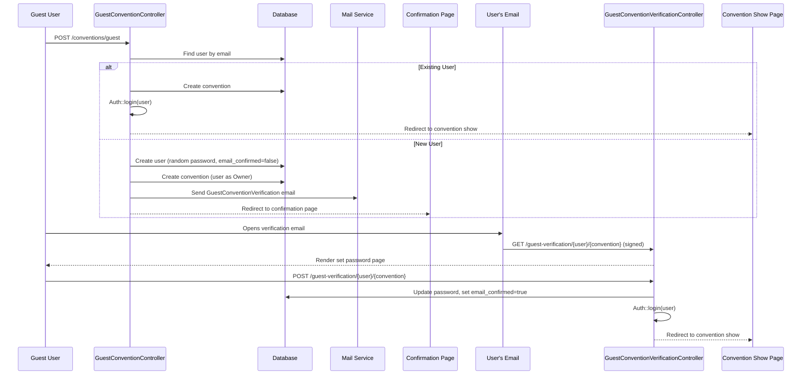

# Design Document: Guest Convention Email Verification

## Overview

This design modifies the guest convention creation flow to require email verification for new users before they can access the system. Currently, `GuestConventionController::store` creates a user (or finds an existing one), creates the convention, and auto-logs the user in regardless of whether they are new or existing. The new behavior introduces a fork:

- **Existing users**: Retain the current auto-login + redirect to convention show page.
- **New users**: Account is created (random password, `email_confirmed=false`), convention is created, a verification email is sent, and the user is redirected to a confirmation page (not logged in). The user must click the signed URL in the email, set a password, and only then gets logged in and redirected to their convention.

This closely mirrors the existing user invitation flow (`InvitationController` + `UserInvitation` mailable) but is triggered from the guest convention creation path instead of a manager-initiated invitation.

## Architecture

The feature follows the existing Laravel + Inertia.js patterns already established in the codebase. No new architectural patterns are introduced.



### Key Design Decisions

1. **New controller instead of reusing InvitationController**: The guest verification flow has different post-activation behavior (redirect to convention show page + auto-login) compared to invitations (redirect to login page). A dedicated `GuestConventionVerificationController` keeps concerns separated and avoids conditional logic in the invitation flow.

2. **New mailable instead of reusing UserInvitation**: The email content differs — the guest verification email references "your convention" rather than "you've been invited." A dedicated `GuestConventionVerification` mailable provides appropriate messaging.

3. **Reuse of existing pages**: The set password page (`invitation.tsx`) pattern is reused with a new page component that points to the guest verification routes. The invalid link page (`invitation-invalid.tsx`) pattern is reused similarly.

## Components and Interfaces

### Backend Components

#### 1. `GuestConventionController` (Modified)

File: `app/Http/Controllers/GuestConventionController.php`

Changes to `store()` method:
- After creating a new user + convention, instead of `Auth::login()` + redirect to convention show, generate a signed URL and send the verification email, then redirect to the confirmation page.
- Existing user path remains unchanged (auto-login + redirect).

```php
public function store(StoreGuestConventionRequest $request, CreateConventionAction $action): \Symfony\Component\HttpFoundation\Response
{
    $validated = $request->validated();
    $user = User::where('email', $validated['email'])->first();
    $isNewUser = !$user;

    if ($isNewUser) {
        $user = User::create([
            'first_name' => $validated['first_name'],
            'last_name' => $validated['last_name'],
            'email' => $validated['email'],
            'mobile' => $validated['mobile'],
            'password' => Hash::make(Str::random(32)),
            'email_confirmed' => false,
        ]);
    }

    $convention = $action->execute([/* convention fields */], $user);

    if ($isNewUser) {
        // Send verification email
        $verificationUrl = URL::temporarySignedRoute(
            'guest-verification.show',
            now()->addHours(24),
            ['user' => $user->id, 'convention' => $convention->id]
        );
        Mail::to($user->email)->send(
            new GuestConventionVerification($user, $convention, $verificationUrl)
        );

        return Inertia::render('auth/guest-convention-confirmation', [
            'conventionName' => $convention->name,
            'email' => $user->email,
        ]);
    }

    Auth::login($user);
    return redirect()->route('conventions.show', $convention);
}
```

#### 2. `GuestConventionVerificationController` (New)

File: `app/Http/Controllers/Auth/GuestConventionVerificationController.php`

Two methods following the same pattern as `InvitationController`:

- `show(Request $request, User $user, Convention $convention)`: Renders the set password page. Route uses `signed` middleware.
- `store(SetPasswordRequest $request, User $user, Convention $convention)`: Saves password, sets `email_confirmed=true`, logs user in, redirects to convention show page.

```php
class GuestConventionVerificationController extends Controller
{
    public function show(Request $request, User $user, Convention $convention): Response
    {
        return Inertia::render('auth/guest-convention-set-password', [
            'user' => $user->only('id', 'first_name', 'last_name', 'email'),
            'convention' => $convention->only('id', 'name'),
        ]);
    }

    public function store(SetPasswordRequest $request, User $user, Convention $convention): RedirectResponse
    {
        $user->update([
            'password' => $request->validated('password'),
            'email_confirmed' => true,
        ]);

        Auth::login($user);

        return redirect()->route('conventions.show', $convention);
    }
}
```

#### 3. `GuestConventionVerification` Mailable (New)

File: `app/Mail/GuestConventionVerification.php`

Follows the same structure as `UserInvitation` but with guest-specific messaging:

```php
class GuestConventionVerification extends Mailable
{
    public function __construct(
        public User $user,
        public Convention $convention,
        public string $verificationUrl
    ) {}

    public function envelope(): Envelope
    {
        return new Envelope(
            subject: "Verify your email for {$this->convention->name}",
        );
    }

    public function content(): Content
    {
        return new Content(
            markdown: 'emails.guest-convention-verification',
            with: [
                'userName' => $this->user->first_name,
                'conventionName' => $this->convention->name,
                'verificationUrl' => $this->verificationUrl,
                'expiresAt' => now()->addHours(24)->format('M d, Y g:i A'),
            ],
        );
    }
}
```

#### 4. Email Template (New)

File: `resources/views/emails/guest-convention-verification.blade.php`

Markdown email template similar to `user-invitation.blade.php` but with guest-specific copy.

#### 5. Routes (Modified)

File: `routes/web.php`

New routes added outside the auth middleware group:

```php
// Guest convention verification routes (no auth required)
Route::get('guest-verification/{user}/{convention}', [GuestConventionVerificationController::class, 'show'])
    ->name('guest-verification.show')
    ->middleware('signed');
Route::post('guest-verification/{user}/{convention}', [GuestConventionVerificationController::class, 'store'])
    ->name('guest-verification.store');
```

### Frontend Components

#### 1. `guest-convention-confirmation.tsx` (New)

File: `resources/js/pages/auth/guest-convention-confirmation.tsx`

A simple Inertia page rendered after guest convention creation for new users. Displays:
- Convention name
- User's email address
- Instructions to check email
- No authentication required (rendered directly from controller response)

Uses `AuthLayout` for consistent styling.

#### 2. `guest-convention-set-password.tsx` (New)

File: `resources/js/pages/auth/guest-convention-set-password.tsx`

Nearly identical to `invitation.tsx` but:
- Points form action to `guest-verification.store` route
- Title/description reference "your convention" instead of invitation language

Reuses the same password criteria display pattern with real-time feedback.

#### 3. Signed URL Error Handling

The `signed` middleware on the `guest-verification.show` route will throw an `InvalidSignatureException` when the URL is expired or tampered. This is handled by adding a case in the exception handler (or a dedicated middleware) that renders the `auth/invitation-invalid` page with the appropriate `reason` prop (`'expired'` or `'invalid'`).

The existing `invitation-invalid.tsx` page already handles both `expired` and `invalid` reasons with appropriate messaging and a link to the home page. We can either reuse this page directly or create a `guest-convention-invalid.tsx` variant with guest-specific copy. Given the messaging in `invitation-invalid.tsx` references "convention manager" for expired links, a new page with guest-appropriate copy is preferred.

## Data Models

No database schema changes are required. The feature operates entirely within the existing data model:

| Model | Relevant Fields | Usage |
|-------|----------------|-------|
| `User` | `first_name`, `last_name`, `email`, `mobile`, `password`, `email_confirmed` | New user created with random password and `email_confirmed=false`. Updated with real password and `email_confirmed=true` on verification. |
| `Convention` | `name`, `city`, `country`, etc. | Created via `CreateConventionAction` as before. |
| `convention_user` | `convention_id`, `user_id` | Pivot created by `CreateConventionAction`. |
| `convention_user_roles` | `convention_id`, `user_id`, `role` | Owner + ConventionUser roles assigned by `CreateConventionAction`. |

The signed URL is generated at runtime using `URL::temporarySignedRoute()` and is not persisted in the database. The 24-hour expiration is enforced by Laravel's signed URL mechanism.


## Correctness Properties

*A property is a characteristic or behavior that should hold true across all valid executions of a system — essentially, a formal statement about what the system should do. Properties serve as the bridge between human-readable specifications and machine-verifiable correctness guarantees.*

### Property 1: Existing user auto-login preserved

*For any* existing user in the database, when their email is provided during guest convention creation, the system should log them in and redirect to the convention show page.

**Validates: Requirements 1.1**

### Property 2: New user creation without login

*For any* email address that does not exist in the database, when provided during guest convention creation, the system should create a user record with `email_confirmed=false`, create the convention, render the confirmation page, and NOT authenticate the user.

**Validates: Requirements 1.2, 7.2**

### Property 3: Confirmation page displays convention and email

*For any* new user guest convention creation, the confirmation page response should contain the convention name and the user's email address as props.

**Validates: Requirements 2.1**

### Property 4: Verification email contains signed URL and user context

*For any* new user created during guest convention creation, a verification email should be sent to their email address containing a signed URL to the set password page, the user's first name, and the convention name.

**Validates: Requirements 3.1, 3.2, 3.4**

### Property 5: Set password page displays user email

*For any* user and convention with a valid signed URL, the set password page should render with the user's email address available as a prop.

**Validates: Requirements 4.1**

### Property 6: Password validation enforcement

*For any* string that does not satisfy all password criteria (minimum 8 characters, at least one lowercase, one uppercase, one number, one symbol), submitting it as a password on the set password page should be rejected by validation.

**Validates: Requirements 4.3**

### Property 7: Account activation round trip

*For any* valid password submission on the set password page, the system should save the hashed password to the user record, set `email_confirmed` to true, log the user in, and redirect to the convention show page.

**Validates: Requirements 5.1, 5.2, 5.3, 5.4**

### Property 8: New user role assignment

*For any* new user created during guest convention creation, the user should be assigned both the Owner and ConventionUser roles for the created convention.

**Validates: Requirements 7.3**

## Error Handling

### Signed URL Errors

| Scenario | Handling | User Experience |
|----------|----------|-----------------|
| Expired signed URL (>24h) | Laravel `signed` middleware throws `InvalidSignatureException` | Render error page with `reason='expired'`, explain link validity period, link to home page |
| Tampered/invalid signed URL | Laravel `signed` middleware throws `InvalidSignatureException` | Render error page with `reason='invalid'`, explain link may have been modified, link to home page |

The exception handler should catch `InvalidSignatureException` for the `guest-verification.*` routes and render the appropriate error page. This can be handled in `bootstrap/app.php` or via a dedicated middleware, following the same pattern used for invitation routes.

### Validation Errors

| Scenario | Handling |
|----------|----------|
| Invalid guest convention form data | `StoreGuestConventionRequest` returns validation errors (existing behavior) |
| Overlapping convention dates | Custom validator in `StoreGuestConventionRequest` (existing behavior) |
| Invalid password on set password page | `SetPasswordRequest` returns validation errors (reused from invitation flow) |
| Missing password confirmation | `SetPasswordRequest` `confirmed` rule rejects |

### Edge Cases

| Scenario | Handling |
|----------|----------|
| User clicks verification link after already setting password | The set password page renders normally; submitting overwrites the password and re-confirms email. This is harmless. |
| User creates multiple guest conventions with same new email | Each creation sends a new verification email. Only the latest signed URL will work if the user/convention IDs differ, but all remain valid until expiration. The user gets Owner role on each convention. |
| Race condition: user registers between form submission and processing | The `User::where('email', ...)` check handles this — if the user now exists, the existing user flow applies. |

## Testing Strategy

### Property-Based Testing

Property-based tests use [Pest PHP](https://pestphp.com/) with the `faker` data generator to verify universal properties across randomized inputs. Each property test should run a minimum of 100 iterations.

Each property test must be tagged with a comment referencing the design property:
```
// Feature: guest-convention-email-verification, Property {number}: {property_text}
```

Each correctness property must be implemented by a single property-based test.

**Library**: Pest PHP with `faker()` for data generation. Use Pest's `repeat()` or a loop to achieve 100+ iterations per property.

### Unit Tests

Unit tests verify specific examples, edge cases, and error conditions:

- **Confirmation page rendering**: Verify the page contains instructional text about checking email (Requirements 2.2, 2.3)
- **Confirmation page accessibility**: Verify the page renders without authentication (Requirement 2.4)
- **Set password page accessibility**: Verify the page renders without authentication with a valid signed URL (Requirement 4.5)
- **Password and confirmation required**: Verify validation rejects missing password or confirmation (Requirement 4.2)
- **Signed URL expiration**: Verify that an expired URL (>24h) renders the error page with `reason='expired'` (Requirement 6.1)
- **Tampered URL handling**: Verify that a tampered URL renders the error page with `reason='invalid'` (Requirement 6.2)
- **Error page home link**: Verify the error page contains a link to the home page (Requirement 6.3)

### Test Organization

- **Backend property tests**: `tests/Property/GuestConventionVerification/` — one test file per property or grouped logically
- **Backend feature tests**: `tests/Feature/Properties/GuestConventionVerification/` — integration-level property tests that hit the full HTTP stack
- **Backend unit tests**: `tests/Feature/GuestConventionVerification/` — specific examples and edge cases
- **Frontend tests**: `resources/js/pages/auth/__tests__/` — component rendering tests for the new pages
