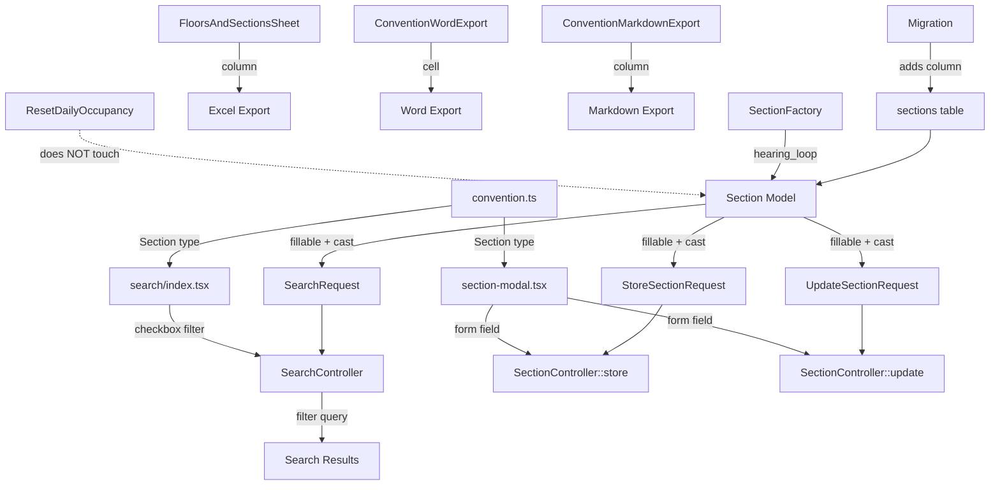

# Design Document: Hearing Loop Section

## Overview

This feature adds a `hearing_loop` boolean accessibility flag to sections, following the identical pattern established by `elder_friendly` and `handicap_friendly`. The change is a vertical slice across the full stack: database migration, Eloquent model, form request validation, React section modal, search page filter, TypeScript types, and all three data export formats (Excel, Word, Markdown).

The implementation is purely additive — no existing behavior changes. Every layer mirrors the existing `handicap_friendly` field placement and logic.

## Architecture

The feature touches every layer of the existing Convention → Floor → Section data flow but introduces no new components, services, or routes. It extends existing ones:



No new routes, controllers, middleware, or policies are needed. The `ResetDailyOccupancy` command only updates occupancy-related fields and does not touch accessibility booleans, so `hearing_loop` is preserved by default.

## Components and Interfaces

### Backend

#### Migration
- New migration: `add_hearing_loop_to_sections_table`
- Adds `boolean('hearing_loop')->default(false)->after('handicap_friendly')`
- Updates the existing `idx_sections_accessibility` index to include all three accessibility columns: `['elder_friendly', 'handicap_friendly', 'hearing_loop']`
- Adds standalone `idx_sections_hearing_loop` index on `hearing_loop` for efficient standalone filtering

#### Section Model (`app/Models/Section.php`)
- Add `'hearing_loop'` to `$fillable` array after `'handicap_friendly'`
- Add `'hearing_loop' => 'boolean'` to `casts()` after `'handicap_friendly'`

#### Form Requests
- `StoreSectionRequest`: add `'hearing_loop' => ['nullable', 'boolean']` after `handicap_friendly` rule
- `UpdateSectionRequest`: add `'hearing_loop' => ['nullable', 'boolean']` after `handicap_friendly` rule
- `SearchRequest`: add `'hearing_loop' => ['nullable', 'boolean']` after `handicap_friendly` rule

#### SearchController (`app/Http/Controllers/SearchController.php`)
- Add `hearing_loop` filter block after `handicap_friendly` block, same pattern: `if ($request->boolean('hearing_loop')) { $query->where('hearing_loop', true); }`
- Add `'hearing_loop'` to the `$request->only([...])` filters array passed to the frontend

#### Export Classes
- `FloorsAndSectionsSheet`: add `'Hearing Loop'` heading and `$section->hearing_loop ? 'Yes' : 'No'` data column after Handicap Friendly
- `ConventionWordExport::addFloorsAndSections()`: add `'Hearing Loop'` header cell and data cell after Handicap Friendly
- `ConventionMarkdownExport::generateContent()`: add `Hearing Loop` table column header and data cell after Handicap Friendly

#### SectionFactory (`database/factories/SectionFactory.php`)
- Add `'hearing_loop' => $this->faker->boolean(20)` to `definition()`
- Add `hearingLoop()` state method returning `['hearing_loop' => true]`

### Frontend

#### TypeScript Type (`resources/js/types/convention.ts`)
- Add `hearing_loop: boolean` to `Section` interface after `handicap_friendly`

#### Section Modal (`resources/js/components/conventions/section-modal.tsx`)
- Add `hearing_loop: false` to `useForm` initial data
- Add `hearing_loop` to `setData` in edit mode effect
- Add "Hearing loop" checkbox after "Handicap friendly" checkbox, same markup pattern:
  ```tsx
  <div className="flex items-center gap-2">
      <Checkbox
          id="section-hearing-loop"
          checked={form.data.hearing_loop}
          onCheckedChange={(checked) => form.setData('hearing_loop', checked === true)}
      />
      <Label htmlFor="section-hearing-loop" className="cursor-pointer text-sm font-normal">
          Hearing loop
      </Label>
  </div>
  ```

#### Search Page (`resources/js/pages/search/index.tsx`)
- Add `hearing_loop?: string` to `SearchFilters` interface
- Add `hearing_loop` to `applyFilters` query building logic (same pattern as `handicap_friendly`)
- Add `handleHearingLoopChange` handler
- Add "Hearing loop" checkbox filter after "Handicap-friendly" checkbox, same markup pattern

## Data Models

### sections table (updated)

| Column | Type | Default | Notes |
|--------|------|---------|-------|
| ... existing columns ... | | | |
| elder_friendly | boolean | false | Existing |
| handicap_friendly | boolean | false | Existing |
| **hearing_loop** | **boolean** | **false** | **New — after handicap_friendly** |
| information | text | nullable | Existing |
| ... remaining columns ... | | | |

### Index Update

The existing composite index `idx_sections_accessibility` on `['elder_friendly', 'handicap_friendly']` will be dropped and recreated as `['elder_friendly', 'handicap_friendly', 'hearing_loop']` to support combined accessibility filtering. A standalone single-column index `idx_sections_hearing_loop` on `hearing_loop` is also added so that queries filtering only on `hearing_loop` (without elder/handicap predicates) can use an index efficiently — B-tree indexes require left-prefix matching, so the third column of a composite index cannot be used in isolation.


## Correctness Properties

*A property is a characteristic or behavior that should hold true across all valid executions of a system — essentially, a formal statement about what the system should do. Properties serve as the bridge between human-readable specifications and machine-verifiable correctness guarantees.*

### Property 1: Section hearing_loop round-trip

*For any* section created or updated with a boolean `hearing_loop` value (true or false), reading the section back from the database should return the same boolean value for `hearing_loop`. A section created without specifying `hearing_loop` should default to `false`.

**Validates: Requirements 1.1, 2.1, 2.2, 4.3, 4.4, 4.5**

### Property 2: Validation accepts valid booleans and rejects invalid values

*For any* request containing `hearing_loop`, if the value is a valid boolean representation (true, false, 1, 0, null), the validation should pass. For any non-boolean value (strings, arrays, floats), the validation should fail. This applies uniformly to `StoreSectionRequest`, `UpdateSectionRequest`, and `SearchRequest`.

**Validates: Requirements 3.1, 3.2, 5.4**

### Property 3: Search filter returns only hearing_loop sections

*For any* set of sections with mixed `hearing_loop` values, when the search is performed with the `hearing_loop` filter active, every section in the result set must have `hearing_loop = true`, and the response filters object must include the `hearing_loop` filter value.

**Validates: Requirements 5.5, 5.6**

### Property 4: Export includes hearing_loop for all sections

*For any* section with any `hearing_loop` value, all three export formats (Excel, Word, Markdown) must include the `hearing_loop` status in their output. Sections with `hearing_loop = true` must show "Yes" and sections with `hearing_loop = false` must show "No".

**Validates: Requirements 7.1**

### Property 5: Daily reset preserves hearing_loop

*For any* section with any `hearing_loop` value, after the daily occupancy reset command runs, the `hearing_loop` value must remain unchanged. The reset only affects occupancy-related fields.

**Validates: Requirements 8.1**

## Error Handling

This feature introduces no new error paths. All error handling follows existing patterns:

- **Validation errors**: Laravel form request validation returns 422 with field-specific error messages. The `hearing_loop` field uses `['nullable', 'boolean']` — invalid values produce a standard "The hearing loop field must be true or false." validation message.
- **Database errors**: The column has a default value of `false`, so missing values in bulk operations or raw queries won't cause NOT NULL violations.
- **Frontend errors**: The checkbox component only produces boolean values, so invalid input from the UI is not possible. `InputError` component displays any server-side validation errors if they occur.

## Testing Strategy

### Property-Based Tests (Pest PHP with Faker-driven generation)

Each correctness property maps to one or more property-based tests running a minimum of 100 iterations:

| Property | Test Location | Description |
|----------|--------------|-------------|
| P1: Round-trip | `tests/Property/` | Create sections with random hearing_loop values, verify persistence and boolean cast |
| P2: Validation | `tests/Property/` | Generate valid and invalid hearing_loop inputs, verify StoreSectionRequest/UpdateSectionRequest/SearchRequest accept/reject correctly |
| P3: Search filter | `tests/Feature/Properties/` | Create sections with random hearing_loop values, search with filter active, verify all results have hearing_loop=true |
| P4: Export | `tests/Feature/Properties/` | Create sections with random hearing_loop values, generate all three export formats, verify hearing_loop appears in output |
| P5: Reset preservation | `tests/Property/` | Create sections with random hearing_loop values, run reset command, verify hearing_loop unchanged |

Each property test must be tagged with a comment:
```php
// Feature: hearing-loop-section, Property {N}: {property_text}
```

### Unit Tests

Focused on specific examples and edge cases:

- Section model: verify `hearing_loop` is in fillable array and casts to boolean
- Factory: verify `hearingLoop()` state method works
- Export output: verify "Hearing Loop" column header exists in each format

### Frontend Tests (Vitest + fast-check)

- Section modal: verify "Hearing loop" checkbox renders, submits correct value
- Search page: verify "Hearing loop" filter checkbox renders and triggers correct query params
- TypeScript compilation: `npm run types:check` validates the Section type includes `hearing_loop`

### Test Configuration

- Backend property tests: minimum 100 iterations using Pest's `repeat()` or loop-based generation
- Frontend property tests: minimum 100 iterations using `fast-check` `fc.assert` with `numRuns: 100`
- PBT library: Pest PHP with Faker for backend, fast-check for frontend
