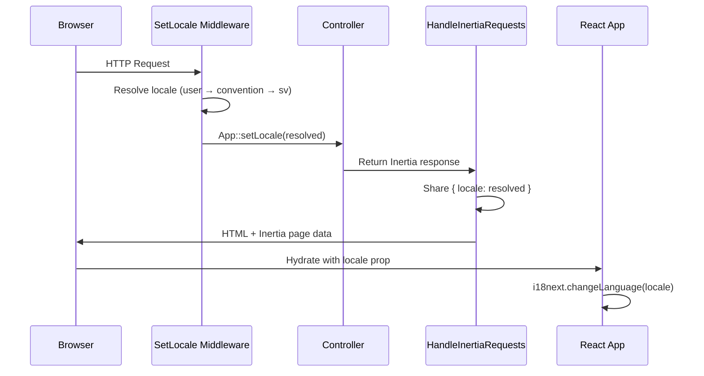
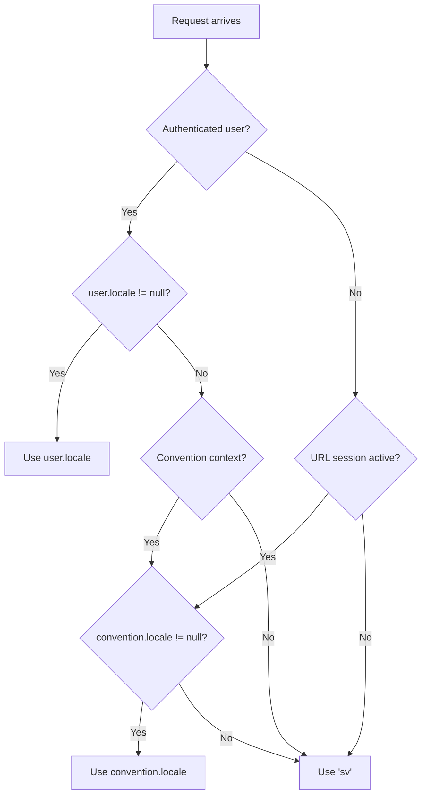

# Design Document: Internationalization

## Overview

This design adds a complete internationalization (i18n) system to the Convention Management System. Laravel is the single source of truth for all translations, stored in `lang/{locale}/` directories organized by domain. The React frontend consumes translations via two public API endpoints using `react-i18next`. Locale resolution follows a priority chain: authenticated user preference → convention default locale → Swedish (`sv`) fallback.

The system touches every layer of the application:
- **Database**: New `locale` columns on `users` and `conventions` tables
- **Middleware**: A `SetLocale` middleware resolves and applies the active locale per-request
- **API**: A `LocaleController` serves available locales and merged translation data
- **Inertia**: `HandleInertiaRequests` shares the resolved locale with the frontend
- **Email**: Each Mailable resolves the recipient's locale before rendering
- **Frontend**: `react-i18next` bootstraps from the Laravel API; a `LocaleSelector` component allows switching
- **Automation**: A Kiro hook scans for new translation keys on file changes

### Supported Locales

Initially: English (`en`) and Swedish (`sv`). Adding a new locale requires only creating a `lang/{new_locale}/` directory with the domain files — the API auto-discovers it.

### Design Decisions

1. **Laravel as single source of truth**: No static JSON files in the frontend. All translations live in `lang/{locale}/*.php` and are served via API. This avoids drift between backend and frontend translations.
2. **Public API endpoints**: Both `/api/locales` and `/api/translations/{locale}` are unauthenticated so that public pages (welcome) and anonymous URL sessions can load translations.
3. **Middleware-based resolution**: A global `SetLocale` middleware runs before controllers, ensuring `App::getLocale()` is correct for all `__()` calls, validation messages, and Inertia shared data.
4. **localStorage for anonymous users**: URL session users cannot persist locale to the database, so we use `localStorage` keyed by convention ID.
5. **react-i18next with custom backend**: We use `i18next-http-backend` to fetch from `/api/translations/{locale}`, avoiding bundled translation files.

## Architecture

```mermaid
flowchart TD
    subgraph Backend
        LangFiles["lang/{locale}/*.php<br/>Translation Files"]
        SetLocale["SetLocale Middleware"]
        LocaleCtrl["LocaleController"]
        HandleInertia["HandleInertiaRequests"]
        Mailables["Mailable Classes"]
    end

    subgraph Database
        UsersTable["users.locale"]
        ConventionsTable["conventions.locale"]
    end

    subgraph Frontend
        i18nInit["i18n.ts Bootstrap"]
        ReactI18next["react-i18next"]
        LocaleSelector["LocaleSelector Component"]
        Pages["Page & Layout Components"]
    end

    SetLocale -->|reads| UsersTable
    SetLocale -->|reads| ConventionsTable
    SetLocale -->|App::setLocale| HandleInertia
    HandleInertia -->|shares locale| i18nInit
    LocaleCtrl -->|reads| LangFiles
    i18nInit -->|GET /api/translations/{locale}| LocaleCtrl
    i18nInit -->|configures| ReactI18next
    ReactI18next -->|t() calls| Pages
    LocaleSelector -->|updates| UsersTable
    LocaleSelector -->|updates| ReactI18next
    Mailables -->|reads| UsersTable
    Mailables -->|App::setLocale| LangFiles
```

### Request Lifecycle



## Components and Interfaces

### 1. Database Migrations

**Migration: `add_locale_to_users_table`**
- Adds `locale` column: `string`, nullable, default `null`
- Position: after `email_confirmed` column

**Migration: `add_locale_to_conventions_table`**
- Adds `locale` column: `string`, nullable, default `'sv'`
- Position: after `section_url_token` column

### 2. Model Changes

**User model** (`app/Models/User.php`):
- Add `'locale'` to `$fillable` array

**Convention model** (`app/Models/Convention.php`):
- Add `'locale'` to `$fillable` array

### 3. LocaleController

**File**: `app/Http/Controllers/LocaleController.php`

```php
class LocaleController extends Controller
{
    /**
     * GET /api/locales
     * Returns array of available locale codes from lang/ subdirectories.
     */
    public function index(): JsonResponse
    {
        $locales = collect(File::directories(lang_path()))
            ->map(fn ($dir) => basename($dir))
            ->values();

        return response()->json($locales);
    }

    /**
     * GET /api/translations/{locale}
     * Returns merged key-value pairs from all domain files for the locale.
     * 404 if locale directory doesn't exist.
     */
    public function show(string $locale): JsonResponse
    {
        $path = lang_path($locale);

        if (!File::isDirectory($path)) {
            abort(404);
        }

        $translations = [];
        foreach (File::files($path) as $file) {
            if ($file->getExtension() === 'php') {
                $domain = $file->getFilenameWithoutExtension();
                $translations[$domain] = require $file->getPathname();
            }
        }

        return response()->json($translations);
    }
}
```

**Routes** (in `routes/web.php`, public):
```php
Route::get('api/locales', [LocaleController::class, 'index'])->name('locales.index');
Route::get('api/translations/{locale}', [LocaleController::class, 'show'])->name('translations.show');
```

### 4. SetLocale Middleware

**File**: `app/Http/Middleware/SetLocale.php`

Resolution priority:
1. Authenticated user's `locale` column (if not null)
2. URL session convention's `locale` column (if URL session active)
3. Fallback: `'sv'`

```php
class SetLocale
{
    public function handle(Request $request, Closure $next): Response
    {
        $locale = null;

        // Priority 1: Authenticated user preference
        if ($user = $request->user()) {
            $locale = $user->locale;
        }

        // Priority 2: Convention locale from URL session
        if (!$locale) {
            $urlSession = $request->session()->get('url_session');
            if ($urlSession) {
                $convention = Convention::find($urlSession['convention_id']);
                $locale = $convention?->locale;
            }
        }

        // Priority 3: Fallback
        App::setLocale($locale ?? 'sv');

        return $next($request);
    }
}
```

Registered as global middleware in `bootstrap/app.php` so it runs on every web request.

### 5. HandleInertiaRequests Modifications

Add `'locale'` to the shared data array:

```php
$shared = [
    // ...existing shared data...
    'locale' => App::getLocale(),
];
```

### 6. Email Locale Resolution

Each Mailable class gains a `build()` or overridden `content()` method that sets the locale before rendering:

**UserInvitation**: Resolves from `$this->user->locale ?? 'sv'`
**EmailConfirmation**: Resolves from `$this->user->locale ?? 'sv'`
**GuestConventionVerification**: Resolves from `$this->user->locale ?? 'sv'` (the sending/creating user's locale)

Implementation pattern for each Mailable — override `build()`:
```php
public function build(): static
{
    $locale = $this->user->locale ?? 'sv';
    App::setLocale($locale);

    return $this->markdown('emails.user-invitation')
        ->subject(__('emails.invitation_subject', ['convention' => $this->convention->name]))
        ->with([...]);
}
```

### 7. Frontend i18n Bootstrap

**File**: `resources/js/lib/i18n.ts`

```typescript
import i18n from 'i18next';
import { initReactI18next } from 'react-i18next';
import HttpBackend from 'i18next-http-backend';

i18n
    .use(HttpBackend)
    .use(initReactI18next)
    .init({
        fallbackLng: 'sv',
        interpolation: { escapeValue: false },
        backend: {
            loadPath: '/api/translations/{{lng}}',
        },
    });

export default i18n;
```

**Integration in `app.tsx`**:
```typescript
import './lib/i18n';
// i18n is initialized as a side effect on import
```

**Locale sync**: After Inertia hydration, read `page.props.locale` and call `i18n.changeLanguage(locale)`. This is done via a `useLocaleSync` hook that listens to Inertia page props changes.

**File**: `resources/js/hooks/use-locale-sync.ts`
```typescript
export function useLocaleSync() {
    const { locale } = usePage<PageProps>().props;
    const { i18n } = useTranslation();

    useEffect(() => {
        if (locale && i18n.language !== locale) {
            i18n.changeLanguage(locale);
        }
    }, [locale, i18n]);
}
```

This hook is called in `AppLayout` and `AuthLayout` to ensure locale stays in sync on every Inertia navigation.

### 8. LocaleSelector Component

**File**: `resources/js/components/locale-selector.tsx`

A dropdown component that:
1. Fetches available locales from `GET /api/locales` on mount (cached)
2. Displays current locale
3. On selection:
   - **Authenticated user**: PATCHes to profile update endpoint with `{ locale: selectedLocale }`, then calls `i18n.changeLanguage()`
   - **URL session user**: Stores in `localStorage` as `locale_{convention_id}`, calls `i18n.changeLanguage()`

Uses Radix UI `DropdownMenu` or Headless UI `Listbox` for the selector, consistent with existing UI patterns.

### 9. Integration Points

| Location | Component | Behavior |
|---|---|---|
| Convention show page | Locale selector next to Export/Delete actions | Owner/Admin can change `conventions.locale` |
| User profile settings | Locale selector in profile form | Authenticated user updates `users.locale` |
| Welcome page | Locale selector in guest convention form | Sets `conventions.locale` and `users.locale` on creation |
| App sidebar | LocaleSelector in footer (URL sessions) | Anonymous users switch locale via localStorage |
| Settings layout nav | Locale link/selector | Quick access for authenticated users |

### 10. Translation File Structure

```
lang/
├── en/
│   ├── auth.php
│   ├── convention.php
│   ├── floor.php
│   ├── section.php
│   ├── user.php
│   ├── search.php
│   ├── attendance.php
│   ├── settings.php
│   ├── emails.php
│   ├── validation.php
│   ├── public.php
│   ├── notifications.php
│   ├── navigation.php
│   ├── export.php
│   └── common.php
└── sv/
    ├── auth.php
    ├── convention.php
    ├── floor.php
    ├── section.php
    ├── user.php
    ├── search.php
    ├── attendance.php
    ├── settings.php
    ├── emails.php
    ├── validation.php
    ├── public.php
    ├── notifications.php
    ├── navigation.php
    ├── export.php
    └── common.php
```

Each file returns a flat or nested associative array using dot-notation-compatible keys:
```php
// lang/en/convention.php
return [
    'create' => [
        'title' => 'Create Convention',
        'name_label' => 'Convention Name',
        // ...
    ],
    'show' => [
        'title' => ':name',
        'floors_heading' => 'Floors',
        // ...
    ],
];
```

### 11. Kiro Translation Scanner Hook

**File**: `.kiro/hooks/translation-scanner.md`

A Kiro hook that triggers on file creation/modification events. It:
1. Scans the changed file for `t('key')` (frontend) and `__('key')` (backend) calls using regex
2. For each key not present in `lang/en/`, adds it to the appropriate domain file with the English string as value
3. For each new key added to `en/`, adds a placeholder entry to all other locale directories (e.g., `sv/`)

This is a development-time automation, not a runtime component.

### 12. Backend String Replacement Strategy

All hardcoded English strings in the following locations are replaced with `__()` calls:

- **Controllers**: Flash messages (`->with('success', __('convention.created'))`)
- **Actions**: Any user-facing strings
- **Form Requests**: Custom validation messages via `messages()` method
- **Blade email templates**: `@lang('emails.invitation.greeting', ['name' => $userName])` or `{{ __('emails.invitation.greeting', ['name' => $userName]) }}`
- **Mailable subjects**: `__('emails.invitation_subject', ['convention' => $this->convention->name])`

### 13. Frontend String Replacement Strategy

All hardcoded strings in React components are replaced with `t()` calls from `useTranslation()`:

```typescript
import { useTranslation } from 'react-i18next';

function MyComponent() {
    const { t } = useTranslation();
    return <h1>{t('convention.create.title')}</h1>;
}
```

This applies to:
- Page components (`pages/`)
- Layout components (`layouts/`)
- Feature components (`components/conventions/`, etc.)
- General components (breadcrumbs, headings, nav items)
- All `aria-label`, `placeholder`, `title`, and `alt` attributes

### 14. TypeScript Type Updates

**`resources/js/types/index.ts`** — Add `locale` to `PageProps`:
```typescript
export interface PageProps {
    // ...existing props...
    locale: string;
}
```

**`resources/js/types/user.ts`** — Add `locale` to User type:
```typescript
export interface User {
    // ...existing fields...
    locale: string | null;
}
```

**`resources/js/types/convention.ts`** — Add `locale` to Convention type:
```typescript
export interface Convention {
    // ...existing fields...
    locale: string;
}
```

## Data Models

### Users Table (modified)

| Column | Type | Nullable | Default | Description |
|--------|------|----------|---------|-------------|
| locale | string | yes | null | User's preferred locale. Null means "use convention or fallback" |

### Conventions Table (modified)

| Column | Type | Nullable | Default | Description |
|--------|------|----------|---------|-------------|
| locale | string | yes | 'sv' | Convention's default locale for anonymous visitors |

### Locale Resolution Chain



