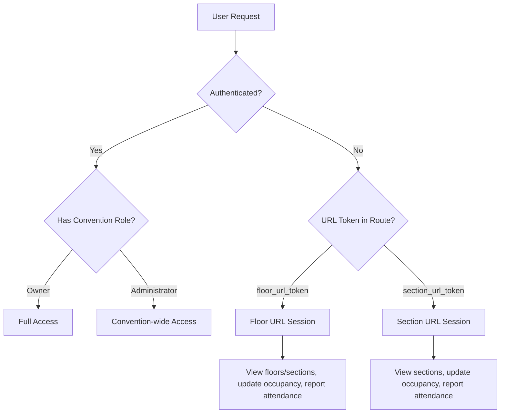
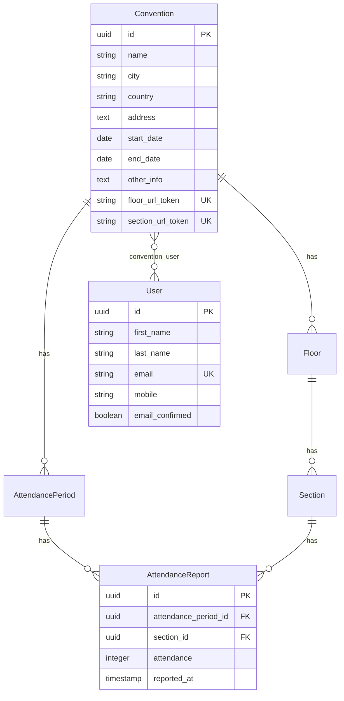

# Design Document: Role & URL Refactoring

## Overview

This design refactors the Convention Management System's access control from a four-tier user-based role system (Owner, ConventionUser, FloorUser, SectionUser) to a two-tier system (Owner, Administrator) supplemented by URL-based anonymous access tokens. The FloorUser and SectionUser roles are replaced by shareable URLs that grant equivalent permissions without requiring user accounts, simplifying user management while maintaining granular access control.

The refactoring touches every layer of the stack: database schema (migrations to drop pivot tables, add token columns, remove `reported_by`), backend (models, middleware, policies, controllers, actions, services), and frontend (TypeScript types, React hooks, components, pages, sidebar navigation).

### Key Design Decisions

1. **Session-based URL tokens** — URL sessions store convention ID, token type, and permissions in the Laravel session. This avoids creating pseudo-user records and keeps the auth layer clean.
2. **Middleware-first access control** — A new `EnsureUrlSessionAccess` middleware handles URL session authorization, running alongside the existing `EnsureConventionAccess` (which is updated to also accept URL sessions).
3. **Single migration file** — All schema changes (drop tables, add columns, rename roles, remove `reported_by`) are bundled in one reversible migration to maintain atomicity.
4. **Token uniqueness via database constraint** — `floor_url_token` and `section_url_token` columns have unique indexes, with tokens generated using `Str::random(64)`.

## Architecture

The refactored system has two access paths:



### Middleware Pipeline Changes

Current pipeline for convention-scoped routes:
```
auth → EnsureConventionAccess → ScopeByRole → Controller
```

New pipeline adds a URL session path:
```
# Authenticated user path (unchanged structure, simplified roles)
auth → EnsureConventionAccess → Controller

# URL session entry point (new public route)
InitUrlSession (sets session from token) → redirect to convention

# URL session access path (convention-scoped routes)
EnsureConventionOrUrlAccess → Controller
```

Key changes:
- `EnsureConventionAccess` is renamed to `EnsureConventionOrUrlAccess` and extended to accept URL sessions
- `ScopeByRole` middleware is **removed entirely** — no longer needed since Owner/Administrator see everything and URL sessions have fixed permission sets
- `EnsureOwnerRole` remains unchanged
- New `InitUrlSession` middleware handles the URL token entry point, creates the session, and redirects

### Route Changes

New public routes for URL token entry:
```php
Route::get('url-access/floor/{token}', [UrlAccessController::class, 'floor'])->name('url-access.floor');
Route::get('url-access/section/{token}', [UrlAccessController::class, 'section'])->name('url-access.section');
```

Convention-scoped routes update their middleware from `EnsureConventionAccess` to `EnsureConventionOrUrlAccess`. Routes that require authenticated users (user management, convention CRUD, attendance start/stop) keep the `auth` middleware and are inaccessible to URL sessions.

## Components and Interfaces

### Backend Components

#### 1. Migration: `simplify_roles_and_add_url_tokens`

**Up:**
- Add `floor_url_token` (string, 64 chars, unique, nullable) to `conventions` table
- Add `section_url_token` (string, 64 chars, unique, nullable) to `conventions` table
- Generate tokens for all existing conventions
- Rename `ConventionUser` role to `Administrator` in `convention_user_roles`
- Delete all `FloorUser` and `SectionUser` role entries from `convention_user_roles`
- Drop `floor_user` table
- Drop `section_user` table
- Remove `reported_by` column from `attendance_reports` table

**Down:**
- Re-create `floor_user` and `section_user` tables
- Add `reported_by` column back to `attendance_reports`
- Rename `Administrator` back to `ConventionUser` in `convention_user_roles`
- Drop `floor_url_token` and `section_url_token` from `conventions`

#### 2. Convention Model Updates

```php
// New fillable fields
protected $fillable = [
    'name', 'city', 'country', 'address',
    'start_date', 'end_date', 'other_info',
    'floor_url_token', 'section_url_token',
];

// New hidden fields (tokens should not leak to frontend by default)
protected $hidden = ['floor_url_token', 'section_url_token'];

// Boot method to auto-generate tokens on creation
protected static function booted(): void
{
    static::creating(function (Convention $convention) {
        $convention->floor_url_token ??= Str::random(64);
        $convention->section_url_token ??= Str::random(64);
    });
}

// Helper to build full URLs
public function floorAccessUrl(): string
{
    return route('url-access.floor', $this->floor_url_token);
}

public function sectionAccessUrl(): string
{
    return route('url-access.section', $this->section_url_token);
}
```

#### 3. User Model Updates

- Remove `floors()` relationship (BelongsToMany via `floor_user`)
- Remove `sections()` relationship (BelongsToMany via `section_user`)
- Update `hasRole()` / `hasAnyRole()` — no logic change needed, just the role strings change from `ConventionUser` to `Administrator`

#### 4. AttendanceReport Model Updates

- Remove `reported_by` from `$fillable`
- Remove `reportedBy()` relationship
- Keep `reported_at` for timestamp tracking

#### 5. AttendanceReportService Updates

- Remove `reported_by` parameter from `reportAttendance()`
- Remove the "only original reporter can update" restriction
- Accept an optional `?User $user` parameter (null for URL sessions)
- Update `AttendanceReport::create()` to omit `reported_by`

#### 6. New Controller: `UrlAccessController`

```php
class UrlAccessController extends Controller
{
    public function floor(string $token): RedirectResponse
    {
        $convention = Convention::where('floor_url_token', $token)->firstOrFail();

        session([
            'url_session' => [
                'convention_id' => $convention->id,
                'type' => 'floor',
                'token' => $token,
            ],
        ]);

        return redirect()->route('conventions.show', $convention);
    }

    public function section(string $token): RedirectResponse
    {
        $convention = Convention::where('section_url_token', $token)->firstOrFail();

        session([
            'url_session' => [
                'convention_id' => $convention->id,
                'type' => 'section',
                'token' => $token,
            ],
        ]);

        return redirect()->route('conventions.show', $convention);
    }
}
```

#### 7. Middleware: `EnsureConventionOrUrlAccess`

Replaces `EnsureConventionAccess`. Checks:
1. If user is authenticated and has a role for the convention → allow
2. If session has `url_session` with matching `convention_id` → allow
3. Otherwise → abort 403

#### 8. Policy Updates

**ConventionPolicy:**
- `update()`: Change `['Owner', 'ConventionUser']` → `['Owner', 'Administrator']`
- No changes to `delete()` or `export()` (Owner-only)

**FloorPolicy:**
- `create()`: `['Owner', 'Administrator']`
- `view()`: `['Owner', 'Administrator']` (remove FloorUser branch)
- `update()`: `['Owner', 'Administrator']` (remove FloorUser branch)
- `delete()`: `['Owner', 'Administrator']` (remove FloorUser branch)

**SectionPolicy:**
- Simplify all methods to check `['Owner', 'Administrator']` for full access
- Remove FloorUser and SectionUser branches entirely
- URL session permissions are checked in middleware/controllers, not policies

**UserPolicy:**
- Remove FloorUser/SectionUser references
- Only Owner and Administrator can manage users

#### 9. CreateConventionAction Updates

- Change role assignment from `['Owner', 'ConventionUser']` to `['Owner', 'Administrator']`
- Tokens auto-generated by Convention model boot method

#### 10. InviteUserAction Updates

- Remove FloorUser floor assignment logic (`floor_user` inserts)
- Remove SectionUser section assignment logic (`section_user` inserts)
- Only handle Owner and Administrator role assignments

#### 11. ConventionController Updates

- `show()`: Pass `floor_url` and `section_url` to frontend (make tokens visible for Owner/Administrator)
- Share `urlSession` data via Inertia props when URL session is active

#### 12. HandleInertiaRequests Updates

- Share `urlSession` prop (type and convention_id from session, or null)
- When URL session is active, set appearance to Apple theme
- Share `userRoles` without FloorUser/SectionUser options

### Frontend Components

#### 1. TypeScript Type Updates

```typescript
// types/user.ts
export type Role = 'Owner' | 'Administrator';

export interface ConventionUser extends User {
    mobile: string | null;
    email_confirmed: boolean;
    roles?: Role[];
    // Remove floor_ids and section_ids
}
```

```typescript
// types/convention.ts — Convention interface additions
export interface Convention {
    // ... existing fields
    floor_url?: string;    // Full URL, only present for Owner/Administrator
    section_url?: string;  // Full URL, only present for Owner/Administrator
}

// AttendanceReport — remove reported_by fields
export interface AttendanceReport {
    id: string;
    attendance_period_id: string;
    section_id: string;
    attendance: number;
    reported_at: string;
    // Remove: reported_by, reported_by_user
}
```

```typescript
// types/index.ts or types/url-session.ts
export interface UrlSession {
    convention_id: string;
    type: 'floor' | 'section';
}
```

#### 2. Hook Updates

**`use-convention-role.ts`** — Simplified:
```typescript
export function useConventionRole() {
    const { userRoles = [], urlSession } = usePage().props;

    return useMemo(() => {
        const roles = new Set<string>(userRoles);
        const isOwner = roles.has('Owner');
        const isAdministrator = roles.has('Administrator');
        const isUrlSession = !!urlSession;
        const isFloorUrlSession = urlSession?.type === 'floor';
        const isSectionUrlSession = urlSession?.type === 'section';
        const isManager = isOwner || isAdministrator;

        return {
            isOwner,
            isAdministrator,
            isManager,
            isUrlSession,
            isFloorUrlSession,
            isSectionUrlSession,
        } as const;
    }, [userRoles, urlSession]);
}
```

Remove `hasFloorAccess()` and `hasSectionAccess()` — no longer needed.

#### 3. Component Updates

**`nav-convention.tsx`** — Sidebar navigation:
- Rename "Floors" → "Administration"
- Rename "Search" → "Availability"
- Hide "Users" for URL sessions
- Hide "Administration" for section URL sessions (they can't see floors)
- Conditionally show items based on `isUrlSession`, `isFloorUrlSession`, `isSectionUrlSession`

**`app-sidebar.tsx` / `nav-user.tsx`** — User menu:
- Hide user dropdown when `isUrlSession` is true
- Hide profile/logout options for URL sessions

**`convention-card.tsx`** / **Convention show page**:
- Add URL display section with copy buttons for Owner/Administrator
- Use `use-clipboard` hook for copy functionality

**`user-row.tsx`** / **Users index page**:
- Remove FloorUser/SectionUser role options
- Remove floor_ids/section_ids assignment UI
- Only show Owner and Administrator role options

**`floor-row.tsx`**:
- Remove user assignment icons/indicators

**`section-card.tsx`**:
- Remove user assignment icons/indicators
- Remove "reported by" user display from attendance metadata
- Show only date/time of last update

**`role-badge.tsx`**:
- Remove FloorUser and SectionUser badge variants
- Add Administrator badge variant (replacing ConventionUser)

#### 4. Appearance for URL Sessions

When `urlSession` is active, the `HandleInertiaRequests` middleware shares `appearance: 'apple'` as a prop. The `use-appearance` hook checks for this override before falling back to user preference or system default.

## Data Models

### Database Schema Changes

#### `conventions` table (modified)

| Column | Type | Change |
|--------|------|--------|
| `floor_url_token` | `string(64)`, unique, nullable | **Added** |
| `section_url_token` | `string(64)`, unique, nullable | **Added** |

#### `convention_user_roles` table (modified data)

| Change | Details |
|--------|---------|
| Rename role | `ConventionUser` → `Administrator` |
| Delete roles | All `FloorUser` entries removed |
| Delete roles | All `SectionUser` entries removed |

#### `attendance_reports` table (modified)

| Column | Type | Change |
|--------|------|--------|
| `reported_by` | `foreignUuid` | **Removed** |

#### Tables Dropped

| Table | Reason |
|-------|--------|
| `floor_user` | FloorUser role eliminated; replaced by Floor URL |
| `section_user` | SectionUser role eliminated; replaced by Section URL |

### Session Data Structure

URL sessions are stored in the Laravel session (server-side):

```php
session('url_session') = [
    'convention_id' => 'uuid-string',
    'type' => 'floor' | 'section',
    'token' => 'the-64-char-token',
];
```

### Entity Relationship Diagram (Post-Refactoring)




## Correctness Properties

*A property is a characteristic or behavior that should hold true across all valid executions of a system — essentially, a formal statement about what the system should do. Properties serve as the bridge between human-readable specifications and machine-verifiable correctness guarantees.*

### Property 1: Role system invariant

*For any* convention and any user associated with that convention, the set of roles assigned to that user must be a subset of `{Owner, Administrator}`. No role string other than "Owner" or "Administrator" shall exist in the `convention_user_roles` table.

**Validates: Requirements 1.1, 1.5, 1.6**

### Property 2: Owner role assignment on convention creation

*For any* user creating a convention (via authenticated or guest flow), after creation the user's roles for that convention must include "Owner".

**Validates: Requirements 1.2**

### Property 3: Token generation and validity on convention creation

*For any* newly created convention, both `floor_url_token` and `section_url_token` must be non-null strings of at least 32 characters.

**Validates: Requirements 2.1, 2.2, 2.3, 2.4**

### Property 4: Token uniqueness across conventions

*For any* two distinct conventions, their `floor_url_token` values must differ and their `section_url_token` values must differ.

**Validates: Requirements 2.6**

### Property 5: Floor URL session grants correct positive permissions

*For any* valid floor URL token, accessing it must create a session that allows: viewing all floors in the convention, viewing all sections on all floors, updating occupancy for any section, and reporting attendance for any section.

**Validates: Requirements 3.1, 3.2, 3.3, 3.4, 3.5**

### Property 6: Floor URL session denies administrative actions

*For any* floor URL session, the session must be denied permission to: create/edit/delete floors, create/delete sections, access user management, start/stop attendance reports, and lock attendance periods.

**Validates: Requirements 3.6, 3.7, 3.8, 3.9, 3.10**

### Property 7: Section URL session grants correct positive permissions

*For any* valid section URL token, accessing it must create a session that allows: viewing all sections in the convention, updating occupancy for any section, and reporting attendance for any section.

**Validates: Requirements 4.1, 4.2, 4.3, 4.4**

### Property 8: Section URL session denies administrative and floor actions

*For any* section URL session, the session must be denied permission to: view or manage floors, create/delete sections, access user management, start/stop attendance reports, and lock attendance periods.

**Validates: Requirements 4.5, 4.6, 4.7, 4.8, 4.9**

### Property 9: URL visibility for Owner and Administrator

*For any* convention viewed by a user with the Owner or Administrator role, the Inertia page props must include both `floor_url` and `section_url` as non-empty strings.

**Validates: Requirements 5.1, 5.2, 5.3, 5.4**

### Property 10: Attendance report open access

*For any* user with section permissions (Owner, Administrator, floor URL session, or section URL session) and any unlocked attendance period, that user must be able to create or update an attendance report for any section, regardless of who originally created the report.

**Validates: Requirements 8.1, 8.2, 8.3, 8.4, 8.5**

### Property 11: URL session Apple theme

*For any* URL session (floor or section), the appearance theme shared via Inertia props must be set to "apple".

**Validates: Requirements 9.4, 9.5**

### Property 12: Migration role conversion correctness

*For any* database state containing ConventionUser, FloorUser, or SectionUser roles, after running the migration: all ConventionUser roles must be converted to Administrator, and no FloorUser or SectionUser roles must remain.

**Validates: Requirements 10.1, 10.2, 10.3**

### Property 13: Migration token generation for existing conventions

*For all* conventions that exist before the migration runs, after migration each convention must have non-null `floor_url_token` and `section_url_token` values of at least 32 characters.

**Validates: Requirements 10.6**

### Property 14: Migration reversibility

*For any* database state, running the migration up and then down must restore the original schema structure (floor_user table, section_user table, reported_by column) without data loss in the reversible portions.

**Validates: Requirements 10.8**

## Error Handling

### URL Token Access Errors

| Scenario | Response |
|----------|----------|
| Invalid/non-existent token | 404 Not Found |
| Token for deleted convention | 404 Not Found |
| URL session accessing unauthorized route | 403 Forbidden |
| URL session expired (session timeout) | Redirect to token URL for re-initialization |

### Migration Errors

| Scenario | Handling |
|----------|----------|
| Token generation collision (extremely unlikely with 64-char random) | Retry with new random string, up to 3 attempts |
| Migration failure mid-execution | Full rollback via database transaction |
| Rollback requested but data has changed | Restore schema structure; role data for FloorUser/SectionUser cannot be restored (documented limitation) |

### Authorization Errors

| Scenario | Response |
|----------|----------|
| Authenticated user with no role tries convention access | 403 via `EnsureConventionOrUrlAccess` |
| URL session tries to access user management | 403 Forbidden |
| URL session tries to start/stop attendance | 403 Forbidden |
| URL session tries to create/delete floors or sections | 403 Forbidden |

### Session Edge Cases

| Scenario | Handling |
|----------|----------|
| Authenticated user accesses URL token | URL session takes precedence; user sees URL session view |
| Multiple URL sessions (floor then section) | Latest session overwrites previous |
| Session cookie cleared | User must re-access the URL token |

## Testing Strategy

### Backend Testing (Pest PHP)

#### Unit Tests
- `CreateConventionAction`: Verify Owner + Administrator roles assigned, tokens generated
- `InviteUserAction`: Verify only Owner/Administrator roles accepted, no floor/section assignment logic
- `AttendanceReportService`: Verify no `reported_by` handling, any user can update any report
- `Convention` model: Verify token auto-generation in `creating` boot event
- Migration: Verify up/down operations, role conversion, table drops/creates

#### Property-Based Tests (Pest PHP with Faker)
- Each correctness property (1–14) implemented as a dedicated test
- Minimum 100 iterations per property test
- Tag format: `Feature: role-url-refactoring, Property {N}: {title}`
- Use `ConventionTestHelper` for shared setup

#### Feature Tests
- URL access flow: GET token URL → session created → redirect → convention accessible
- Middleware: `EnsureConventionOrUrlAccess` accepts both auth users and URL sessions
- Policy enforcement: URL sessions blocked from admin routes
- Convention show page: URLs visible to Owner/Administrator, hidden from URL sessions

### Frontend Testing (Vitest + fast-check)

#### Unit Tests
- `use-convention-role` hook: Verify `isAdministrator`, `isUrlSession`, `isManager` flags
- `nav-convention`: Verify sidebar labels ("Administration", "Availability"), conditional item visibility
- `role-badge`: Verify only Owner/Administrator variants render
- Convention show page: Verify URL display section with copy buttons for managers
- URL session UI: Verify user dropdown hidden, profile/logout hidden

#### Property-Based Tests (fast-check)
- Each frontend-relevant correctness property implemented with `fc.assert` and `fc.property`
- Minimum 100 iterations per property
- Tag format: `Feature: role-url-refactoring, Property {N}: {title}`
- Focus on:
  - Property 1 (role invariant): Generate random role arrays, verify hook only recognizes Owner/Administrator
  - Property 3 (token validity): Generate random strings, verify length/format validation
  - Property 11 (Apple theme): Generate random URL session states, verify theme is always "apple"

### Test Organization

```
tests/
├── Feature/
│   ├── Properties/
│   │   └── RoleUrlRefactoring/     # Backend property tests (P1-P14)
│   └── UrlAccess/                  # URL access feature tests
├── Property/
│   └── RoleUrlRefactoring/         # Pure property-based unit tests
└── Unit/
    └── RoleUrlRefactoring/         # Unit tests for actions, services, migration

resources/js/
├── hooks/__tests__/
│   └── use-convention-role.test.ts  # Updated hook tests
├── components/conventions/__tests__/
│   └── role-badge.test.tsx          # Updated badge tests
│   └── nav-convention.test.tsx      # Sidebar label/visibility tests
└── pages/conventions/__tests__/
    └── show.test.tsx                # URL display tests
```
