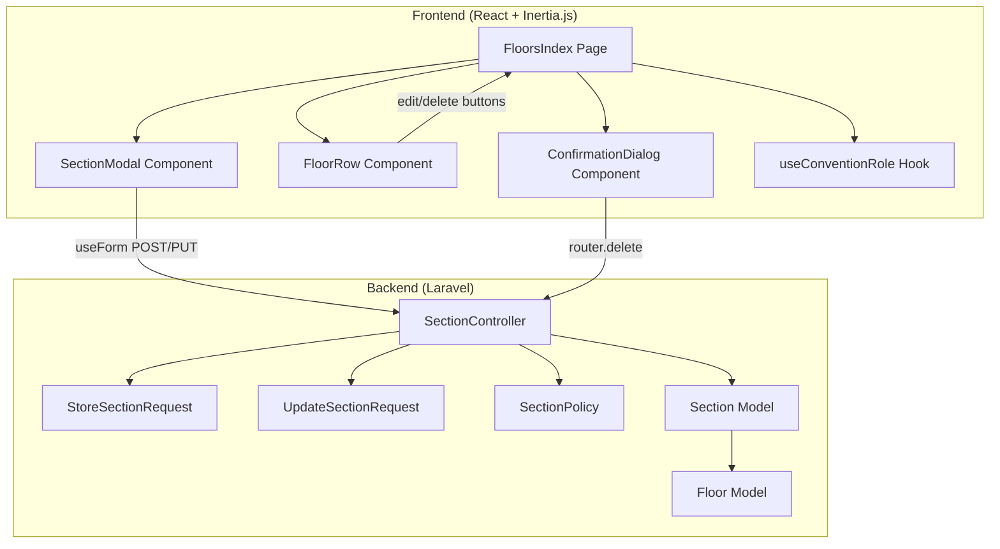

# Design Document: Section CRUD Management

## Overview

This feature adds full Section CRUD (Create, Read, Edit, Delete) capabilities to the existing FloorsIndex page (`resources/js/pages/floors/index.tsx`). Users with appropriate roles (Owner, ConventionUser, FloorUser) can create sections via a modal dialog with a floor selector dropdown, edit existing sections inline, and delete sections with a confirmation prompt. All operations enforce role-based authorization through the existing `SectionPolicy` and are validated server-side via Laravel Form Requests.

The feature integrates into the existing floor management UI by:
- Adding an "Add Section" button in the page header (role-gated)
- Adding edit/delete icon buttons inline within expanded floor rows
- Reusing the existing `Dialog` and `ConfirmationDialog` component patterns
- Leveraging Wayfinder type-safe routing for all API calls

## Architecture

The feature follows the existing Inertia.js architecture pattern established by the floor CRUD implementation on the same page.



### Data Flow

1. **Create**: FloorsIndex → SectionModal → `useForm.post()` → `SectionController@store` → `StoreSectionRequest` validation → `SectionPolicy@create` authorization → Section created → Inertia redirect back to FloorsIndex
2. **Edit**: FloorRow edit button → FloorsIndex opens SectionModal (pre-filled) → `useForm.put()` → `SectionController@update` → `UpdateSectionRequest` validation → `SectionPolicy@update` authorization → Section updated → Inertia redirect
3. **Delete**: FloorRow delete button → FloorsIndex opens ConfirmationDialog → `router.delete()` → `SectionController@destroy` → `SectionPolicy@delete` authorization → Section deleted → Inertia redirect

### Key Design Decisions

1. **Reuse SectionModal for both create and edit**: A single `SectionModal` component handles both modes, reducing duplication. The mode is determined by whether an existing section is passed as a prop.

2. **Floor selector scoped by role**: The floor dropdown in the modal only shows floors the user has access to, using the `userFloorIds` and `userRoles` props already passed to FloorsIndex.

3. **Separate UpdateSectionRequest**: A new `UpdateSectionRequest` form request will be created for the update action, allowing the `floor_id` field to be required only on create (not on update, since sections don't change floors during edit). This keeps validation rules clean and explicit.

4. **Inline action buttons in FloorRow**: Edit and delete buttons are added directly within the FloorRow's expanded section list, following the same pattern used for floor edit/delete buttons. This keeps section management contextual.

5. **Backend redirects to FloorsIndex**: Both store and update actions redirect back to the floors index page (not the section show page), keeping the user in the management context.

## Components and Interfaces

### New Components

#### SectionModal

A dialog component for creating and editing sections.

```typescript
interface SectionModalProps {
    open: boolean;
    onOpenChange: (open: boolean) => void;
    convention: Convention;
    floors: Floor[];
    section?: Section | null; // null = create mode, Section = edit mode
}
```

- Renders a `Dialog` with form fields: name, number_of_seats, elder_friendly, handicap_friendly, information, and floor_id (dropdown)
- Uses `useForm` from `@inertiajs/react` for form state and submission
- In create mode: POSTs to `SectionController@store` via Wayfinder `store.url(convention.id, floorId)`
- In edit mode: PUTs to `SectionController@update` via Wayfinder `update.url(section.id)`
- Auto-selects floor when only one floor is available
- Disables submit button and shows loading text during submission
- Displays inline validation errors from server response

### Modified Components

#### FloorsIndex Page

- Adds "Add Section" button in header (visible to Owner, ConventionUser, FloorUser)
- Manages state for `SectionModal` (open/close, create vs edit mode)
- Manages state for section deletion `ConfirmationDialog`
- Passes `onEditSection` and `onDeleteSection` callbacks to `FloorRow`
- Filters floors list for the modal based on user role

#### FloorRow Component

Updated props interface:

```typescript
interface FloorRowProps {
    floor: Floor;
    sections: Section[];
    userRole: Role;
    userFloorIds: number[];
    userSectionIds: number[];
    onEdit?: (floor: Floor) => void;
    onDelete?: (floor: Floor) => void;
    onEditSection?: (section: Section) => void;
    onDeleteSection?: (section: Section) => void;
}
```

- Adds edit (Pencil) and delete (Trash2) icon buttons next to each section in the expanded list
- Edit button visible when user can edit the section (Owner, ConventionUser, FloorUser for that floor)
- Delete button visible when user can delete the section (Owner, ConventionUser, FloorUser for that floor)
- SectionUser sees no action buttons (or only for assigned sections if they have edit permission — but per policy, SectionUser cannot delete)

### Backend Changes

#### New: UpdateSectionRequest

```php
// app/Http/Requests/UpdateSectionRequest.php
class UpdateSectionRequest extends FormRequest
{
    public function rules(): array
    {
        return [
            'name' => ['required', 'string', 'max:255'],
            'number_of_seats' => ['required', 'integer', 'min:1'],
            'elder_friendly' => ['nullable', 'boolean'],
            'handicap_friendly' => ['nullable', 'boolean'],
            'information' => ['nullable', 'string'],
        ];
    }
}
```

#### Modified: StoreSectionRequest

Add `floor_id` validation for when sections are created from the FloorsIndex page (the floor is selected via dropdown rather than being implicit from the URL):

```php
public function rules(): array
{
    return [
        'floor_id' => ['sometimes', 'required', 'exists:floors,id'],
        'name' => ['required', 'string', 'max:255'],
        'number_of_seats' => ['required', 'integer', 'min:1'],
        'elder_friendly' => ['nullable', 'boolean'],
        'handicap_friendly' => ['nullable', 'boolean'],
        'information' => ['nullable', 'string'],
    ];
}
```

#### Modified: SectionController

- `store`: Update to redirect back to `floors.index` route instead of `conventions.show`. Accept `floor_id` from request body when creating from FloorsIndex.
- `update`: Change to use `UpdateSectionRequest` and redirect to `floors.index` route.
- `destroy`: Change to redirect to `floors.index` route.

## Data Models

### Existing Models (No Changes)

#### Section
| Field | Type | Constraints |
|-------|------|-------------|
| id | integer | Primary key, auto-increment |
| floor_id | integer | Foreign key to floors.id |
| name | string | Required, max 255 chars |
| number_of_seats | integer | Required, min 1 |
| occupancy | integer | Default 0 |
| available_seats | integer | Default 0 |
| elder_friendly | boolean | Default false |
| handicap_friendly | boolean | Default false |
| information | string/null | Optional |
| last_occupancy_updated_by | integer/null | FK to users.id |
| last_occupancy_updated_at | datetime/null | |
| created_at | datetime | |
| updated_at | datetime | |

#### Floor
| Field | Type | Constraints |
|-------|------|-------------|
| id | integer | Primary key, auto-increment |
| convention_id | integer | Foreign key to conventions.id |
| name | string | Required |
| created_at | datetime | |
| updated_at | datetime | |

### Relationships
- Section belongs to Floor (via `floor_id`)
- Floor has many Sections
- Floor belongs to Convention (via `convention_id`)

### Form Data (Frontend)

```typescript
// Create section form data
interface CreateSectionFormData {
    floor_id: number | '';
    name: string;
    number_of_seats: number | '';
    elder_friendly: boolean;
    handicap_friendly: boolean;
    information: string;
}

// Edit section form data (no floor_id — sections don't change floors)
interface EditSectionFormData {
    name: string;
    number_of_seats: number | '';
    elder_friendly: boolean;
    handicap_friendly: boolean;
    information: string;
}
```


## Correctness Properties

*A property is a characteristic or behavior that should hold true across all valid executions of a system — essentially, a formal statement about what the system should do. Properties serve as the bridge between human-readable specifications and machine-verifiable correctness guarantees.*

### Property 1: Add Section button visibility is determined by role

*For any* user with a set of roles for a convention, the "Add Section" button on the FloorsIndex page is visible if and only if the user has at least one of the roles: Owner, ConventionUser, or FloorUser. A user with only the SectionUser role should never see the button.

**Validates: Requirements 1.1, 1.2, 1.3, 1.4**

### Property 2: Floor selector shows exactly the authorized floors

*For any* user and convention, the floors listed in the Floor_Selector dropdown should be exactly the set of floors the user is authorized to access: all convention floors for Owner/ConventionUser, or only assigned floors for FloorUser.

**Validates: Requirements 2.4, 2.5, 2.6**

### Property 3: Valid section creation persists correctly

*For any* valid section data (non-empty name ≤ 255 chars, number_of_seats ≥ 1, valid booleans, valid floor_id), submitting the create form should result in a new section record in the database with matching attributes associated with the selected floor.

**Validates: Requirements 3.1**

### Property 4: Valid section update persists correctly

*For any* existing section and valid updated data, submitting the edit form should result in the section's attributes being updated to match the submitted values, with no other sections affected.

**Validates: Requirements 4.3**

### Property 5: Section deletion removes the section

*For any* existing section, confirming deletion should result in the section no longer existing in the database, and the floor's section count decreasing by one.

**Validates: Requirements 5.3**

### Property 6: Cancelling deletion preserves the section

*For any* existing section, initiating deletion and then cancelling should leave the section and all its data completely unchanged in the database.

**Validates: Requirements 5.5**

### Property 7: Section CRUD authorization enforcement

*For any* user and section, the create/update/delete operations should succeed if and only if the SectionPolicy grants permission. Specifically: Owner and ConventionUser can perform all operations on any section; FloorUser can perform all operations on sections belonging to their assigned floors; SectionUser cannot create or delete sections.

**Validates: Requirements 3.5, 4.6, 5.6**

### Property 8: Section action button visibility matches authorization

*For any* user and section displayed in a floor row, the edit button is visible if and only if the user is authorized to update that section, and the delete button is visible if and only if the user is authorized to delete that section, as determined by the SectionPolicy.

**Validates: Requirements 4.1, 5.1, 6.2, 6.3, 6.4**

### Property 9: Section display contains required information

*For any* section displayed in an expanded floor row, the rendered output should contain the section's name, an occupancy indicator, and the available seats count.

**Validates: Requirements 6.1**

### Property 10: Server-side validation rejects invalid data without state change

*For any* invalid section input (empty name, name > 255 chars, number_of_seats < 1, non-boolean elder_friendly/handicap_friendly, non-string information), the server should return validation errors and the section table should remain unchanged (no new records created, no existing records modified).

**Validates: Requirements 7.1, 7.2, 7.3, 7.4, 7.5, 7.6, 3.3, 4.5**

## Error Handling

### Frontend Error Handling

| Scenario | Handling |
|----------|----------|
| Validation errors from server | Display inline error messages next to corresponding form fields via `form.errors` from Inertia's `useForm` |
| Network failure during submission | Inertia handles this automatically; form `processing` state resets, allowing retry |
| Unauthorized action (403) | Inertia's default error handling displays the error page; buttons should be hidden via role checks to prevent this |
| Section not found (404) | Inertia's default error handling; can occur if section was deleted by another user |

### Backend Error Handling

| Scenario | Handling |
|----------|----------|
| Validation failure | `StoreSectionRequest` / `UpdateSectionRequest` automatically returns 422 with field-level errors |
| Authorization failure | `SectionPolicy` returns 403 via `$this->authorize()` in controller |
| Invalid floor_id on create | Validation rule `exists:floors,id` rejects non-existent floor IDs |
| Concurrent deletion | Eloquent throws `ModelNotFoundException` if section is deleted between page load and action; Laravel returns 404 |

### Edge Cases

- **Single floor auto-selection**: When only one floor is available to the user, the floor selector pre-selects it to reduce friction
- **Empty floors list**: If a FloorUser has no assigned floors (edge case), the floor selector is empty and the form cannot be submitted
- **Rapid double-click**: Submit button is disabled during `processing` state, preventing duplicate submissions

## Testing Strategy

### Property-Based Testing

Use **Pest PHP** with a property-based testing approach. Since Pest doesn't have a built-in PBT library, use the `innmind/black-box` package or implement lightweight randomized testing with Pest's data providers and PHP's `random_int`/`Faker` for input generation. Each property test should run a minimum of 100 iterations.

Each property-based test must be tagged with a comment referencing the design property:
```
// Feature: section-crud-management, Property {number}: {property_text}
```

| Property | Test Approach |
|----------|--------------|
| Property 1: Button visibility by role | Generate random role combinations, render page props, assert button presence matches role check |
| Property 2: Floor selector filtering | Generate random floor assignments and roles, assert filtered floors match expected set |
| Property 3: Valid creation persists | Generate random valid section data via Faker, POST to store, assert DB contains matching record |
| Property 4: Valid update persists | Generate random valid updates via Faker, PUT to update, assert DB record matches |
| Property 5: Deletion removes section | Create random section, DELETE, assert DB no longer contains it |
| Property 6: Cancel preserves section | Create random section, assert section unchanged after no-op (no delete request sent) |
| Property 7: Authorization enforcement | Generate random user/role/floor combinations, attempt CRUD, assert 403 or success matches policy |
| Property 8: Button visibility matches auth | Covered by frontend component tests with role/permission matrix |
| Property 9: Section display info | Generate random sections, render FloorRow, assert output contains name, occupancy, seats |
| Property 10: Validation rejects invalid | Generate random invalid inputs (empty names, negative seats, etc.), POST/PUT, assert 422 and DB unchanged |

### Unit Testing

Unit tests complement property tests by covering specific examples and edge cases:

- **SectionPolicy unit tests**: Specific role/section combinations for create, update, delete
- **StoreSectionRequest / UpdateSectionRequest**: Specific valid and invalid payloads
- **SectionModal component**: Renders correctly in create vs edit mode, pre-selects single floor
- **FloorRow component**: Shows/hides action buttons for specific role scenarios
- **SectionController integration tests**: Full HTTP request/response cycle for each CRUD operation

### Test Organization

```
tests/
├── Feature/
│   ├── Section/
│   │   ├── CreateSectionTest.php      # Properties 3, 7, 10
│   │   ├── UpdateSectionTest.php      # Properties 4, 7, 10
│   │   ├── DeleteSectionTest.php      # Properties 5, 6, 7
│   │   └── SectionAuthorizationTest.php # Property 7 (comprehensive)
│   └── ...
├── Unit/
│   ├── Policies/
│   │   └── SectionPolicyTest.php      # Policy logic unit tests
│   ├── Requests/
│   │   ├── StoreSectionRequestTest.php
│   │   └── UpdateSectionRequestTest.php
│   └── ...
└── ...
```

### Frontend Testing

Frontend component tests (if using Vitest/Testing Library) should cover:
- SectionModal rendering in create and edit modes
- FloorRow section action button visibility by role
- Floor selector filtering logic
- Form submission and error display
